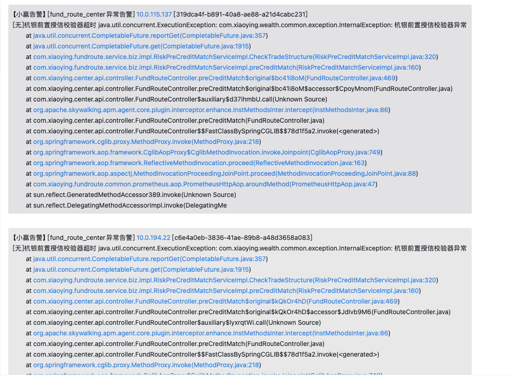
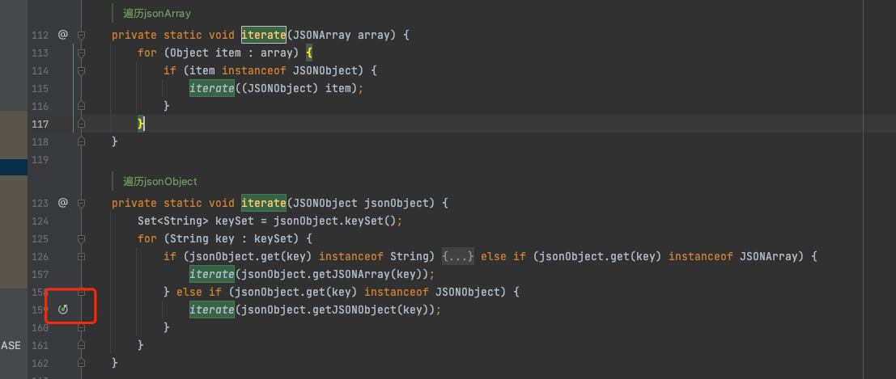
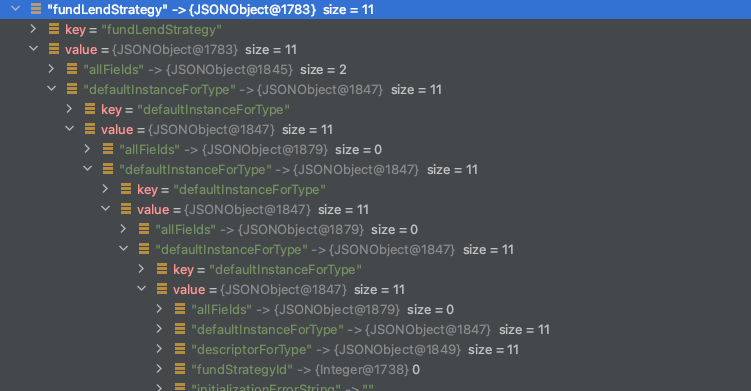
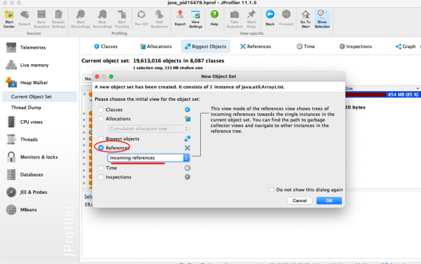
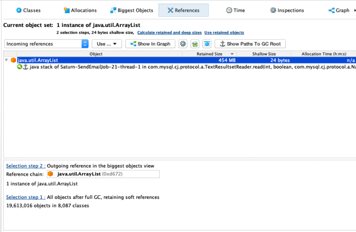
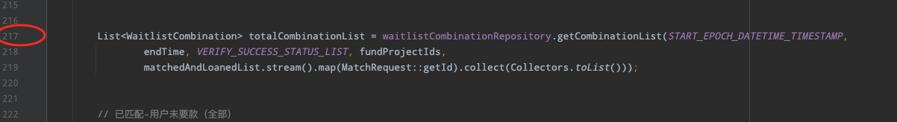

# 记一次OOM问题排查

## 问题发现

### 1、凌晨企业微信收到异常告警
企业微信收到了生产环境的异常告警情况, 有一个服务大面积超时


### 2、通过监控Mesh定位IP地址
通过infra平台上的mesh监控查看机器情况,确定问题机器; 
可以看到 `10.0.121.209`、`10.0.121.234` 两台机器是存在问题的, 错误率达到了100%


### 3、查看日志发现存在 JavaHeapSpace
发现区间内有多个 `java.sql.SQLException: Java heap space` 确定是OOM了
> 虽然表面上是一个 SQLException 错误, 但是其实这种一般是因为试图查询大批量数据加载到内存对象


## 原因分析

### 1、下载OOM时候的dump日志
一般请求下, 生产环境JVM配置会具备以下两个参数, 可以帮助在OOM的时候将堆进行快照备份导出
```shell
-XX:+HeapDumpOnOutOfMemoryError -XX:HeapDumpPath=../log/
```

### 2、使用JProfiler分析
将下载下来的堆文件导入JProfiler


图2中Jprofiler的各项指标含义 
- 类 Classes：显示所有类和它们的实例，可以右击具体的类"Used Selected Instance"实现进一步跟踪
- 分配 Allocations：为所有记录对象显示分配树和分配热点
- Biggest Objects：大对象，堆内存中的对象按大小倒序展示
- 索引 References：为单个对象和“显示到垃圾回收根目录的路径”提供索引图的显示功能。还能提供合并输入视图和输出视图的功能 

进入 `Biggest Objects` tab 页分析以下大对象情况


可以直观的看出,有一个 454M 的 java.util.ArrayList对象，它的元素有3651811。
很直了，可以直接分析出这个大对象产生的堆栈信息: 选中 java.util.ArrayList 对象，右键选择 `Use Selected Objects`，出现弹窗


选中 **Reference**，再选择 **Incoming references** ，最后点击OK，出现新页面


展开 java.util.ArrayList，移动到最右边点击 show more, 展示的就是具体的堆栈信息了


后续可以跟进过滤具体服务代码, 基于前文的 `java.sql.SQLException` 指引, 进一步过滤SQL查询的方法, 
定位到了对应repo层方法代码


通过对应的时间段内, 定位到慢查询日志中与该方法最匹配的SQL
```SQL
SELECT  
FuiMatchRequestId AS matchRequestId,FuiFundItemId AS fundItemId
  FROM t_waitlist_combination 
 WHERE (FuiCreateTime BETWEEN 0 AND 1661270399 AND FuiFundItemId IN (5,7,18,25,27,33,34,38,44,46,50,58,82,85,99,100,104,105,106,109,111,114,116,117,120,121,123,125,127,128,130,131,132,133,135,137,138,139,140,141,142,144,145,146,147,148,149,150,151,152,153,154,155,156,157,158,159,160,161,162,163,164,165,166,167,168,169,170,171,172,173,174,175,176,177,178,179,180,181,182,183,184,186,187,188,189,190,192,193,194,195,196,197,198,199,200,201,202,203,204,205,208,209,210,211,212,213,214,215,216,217,218,219,220,221,222,223,224,225,226,227,229,230,231,232,233,235,236,237,238,239,240,241,242,243,244,245,247,248,249,250,252,254,255,257,258,259,260,261,262,263,264,265,266,267,268,269,270,271,272,273,274,275,276,277,278) AND FuiStatus = 4);
```
 通过WebSql工具查询到该SQL查询了 800W+条记录


