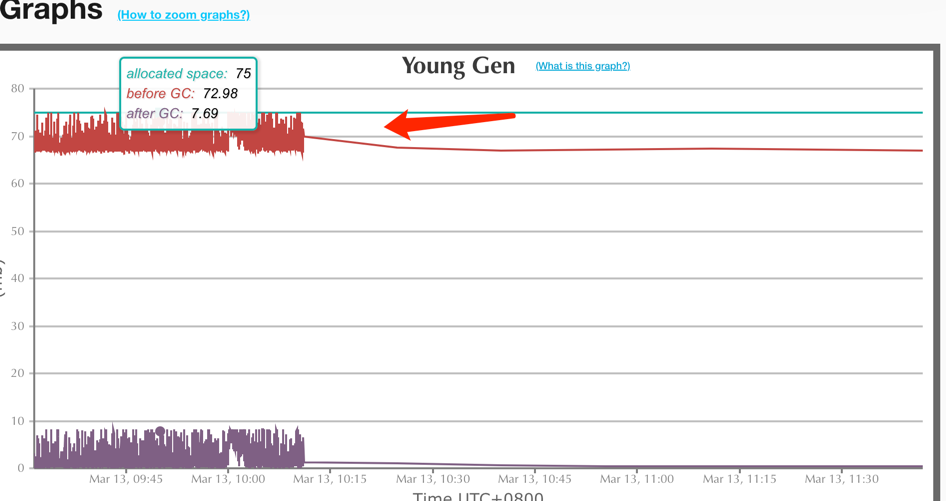

# 缓存雪崩及JVM参数不合理导致频繁YGC异常

## 背景现象
告警来袭, 大早上线上某一个服务突然大量超时, 延时大量增加

日常虽然也会存在也一些超时,但是两条「预筛选信息异步超时」 这两个点比较特殊, 因为这一块业务有过持续优化, 异步内超时一般是因为存在某个接口慢

得先想办法定位到问题出在哪? 是大面积事件还是局部事件?

第一时间查看了 SkyWalking 的耗时情况, 通过分析发现某一个服务其中一台机器的耗时情况异常,且只有这一台异常


通过instance的APM监控也发现了问题根本所在, 在10点前后, 这台机器的YGC耗时与频次突然飚高, 最高一分钟内有13秒是在GC操作,
从右边的次数统计来看，GC也达到了最多300次/分钟的频次


## 原因分析
既然是GC异常, 很简单, 分析GC日志看看先,从服务器下载了对应的gc日志, 
>tips: 生产环境记得打开对应的gc日志
```shell
-XX:+PrintGCDetails //输出详细GC日志
-Xloggc:gc.log // 输出GC日志到文件
-XX:+PrintGCDateStamps // 输出GC的时间戳(以日期的形式,如2013-05-04T21:53:59.234+0800)
-XX:+PrintReferenceGC // 打印年轻代各个引用的数量以及时
```
通过 `EasyGC`分析对应的日志,确认了当时有大连gc抖刺, 且大量的gc都为ygc,  只有少量的FGC发生;
显而易见: 在那段时间内, 有连续的短生命周期的大对象产生, YGC能够完成回收



本着99%的系统问题都是软件代码本身的问题, 大概率是业务本身有问题了, 开始回归到超时19s的接口 `(POST}/fundProject/query-fund-project-base-info-asset`, 跟进内部逻辑

发现这个接口数据返回很多, 且内部的redis缓存在一段时间内大量失效


基本上就能够确认问题了:
1. 堆内存new区较小, 容易产生YGC
2. 连续一段时间有多个大量数据请求的这台机器了,加上缓存的失效导致大量数据打到db, 单个请求平均耗时大量增加, 大量数据都卡在了内存中

## 解决方案

## 反思总结