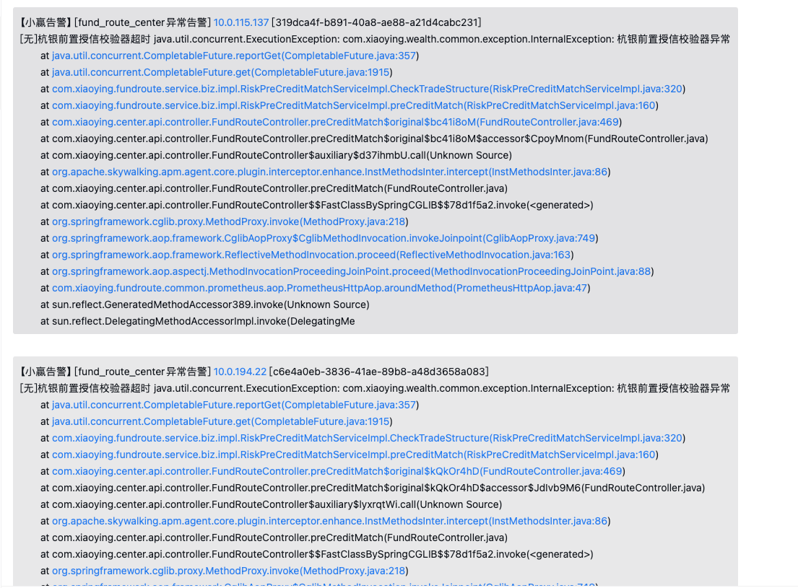
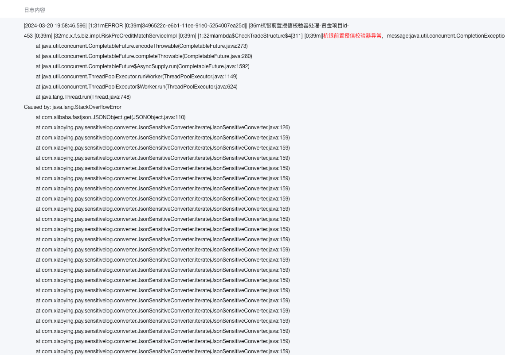
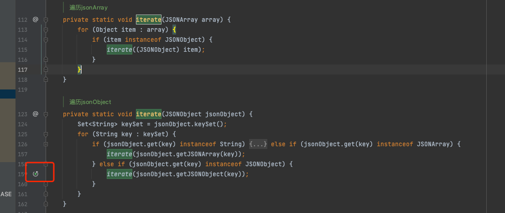
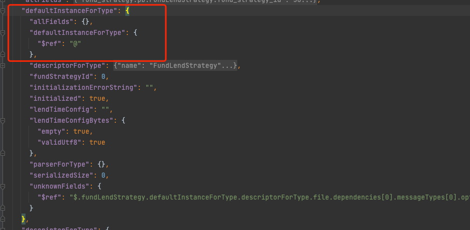
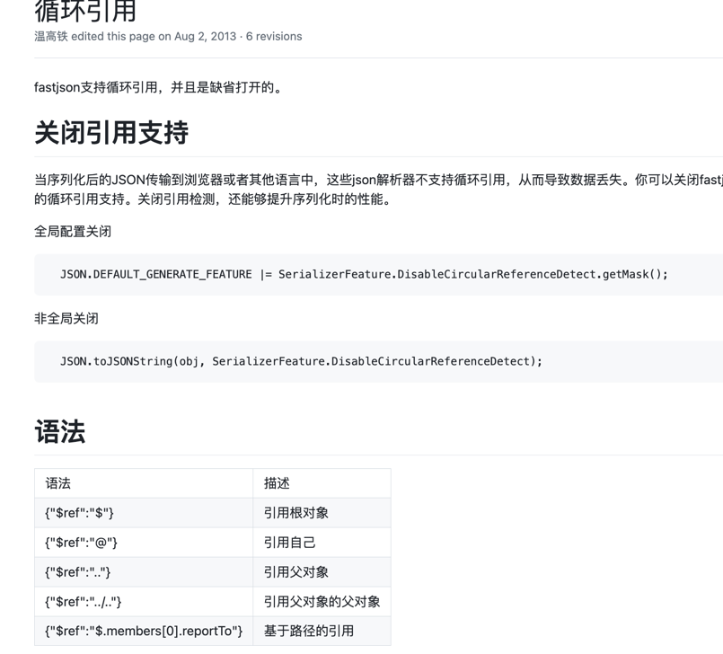
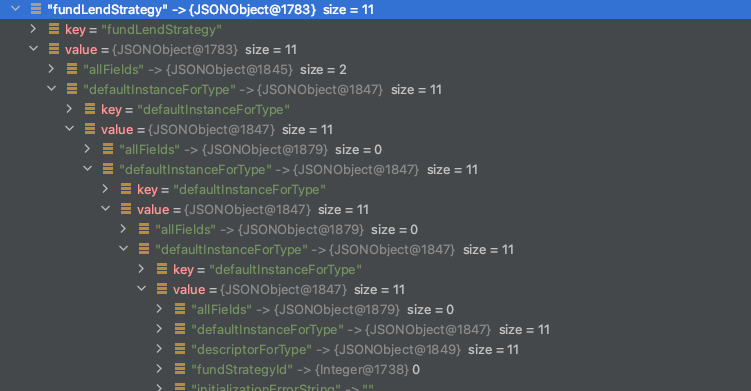

# 线上大量StackOverflow 导致接口超时异常了

## 现象 
晚上7点，企业微信告警出现大量超时, 某一个接口一直在报错,

## 定位
情况比较怪异, 没有GC相关异常, 也没有服务整体的超时异常告警, 怀疑是代码有BUG
果然, 通过 log 日志定位发现有一个 StackOverFlow 的异常

问了下小组同学, 确认该服务正在进行服务版本的发布, 并且得到确认异常的代码是刚刚引入的一个 「日志打印脱敏」 的组件包

## 紧急处理
快速回退了版本

## 后续跟进

### 确认问题根本
1. 开始分析新引入的包，发现敏感词过滤包中, 存在一处代码有递归调用, 这里idea可以明确看到有相关的标志, 下意识想到了可能是循环引用导致递归无下限了

   
2. 接口请求到本地后, 定位到具体接口异常的日志打印处, 果然符合预期, 是存在了循环引用问题
- 进行过滤前的部分日志JSON如下 可以看到有 $ref : @ 自引用存在; 因为系统使用的 FastJSON, 官方有关于循环应用相关的说明, 其中就包含自引用

- 同时将代码debug, 发现JSON反序列化成JSONObject 后的对象内存态如下, 发现了一个 defaultInstanceForType 存在自引用现象

  
> 至此基本确定问题和猜想无区别,  「因为错误的递归引用导致了栈溢出」

### 原因分析
说明一下我们场景背景,项目接入了公司公共的日志脱敏组件, 这个组建通过实现 logback 的 `MessageConverter` 对我们打印的日志进行拦截,进行脱敏操作;  具体的做法是通过将打印的日志通过FastJSON进行反向的json解析, 如果无法解析成json直接返回, 能够解析成json则进行json逐个字段嵌套的递归,查找最终字符串中的敏感词进行脱敏；
而我们出bug的地方使用的场景是: 日志打印的地方是直接将 pb 对象用json打印, 直接是 JSON.toJsonString, 结果导致打印了 pb 的自引用, 反序列化时识别到了自引用, 从而导致组件递归解析的时候出现了循环递归 然后就StackOverflow了
  

