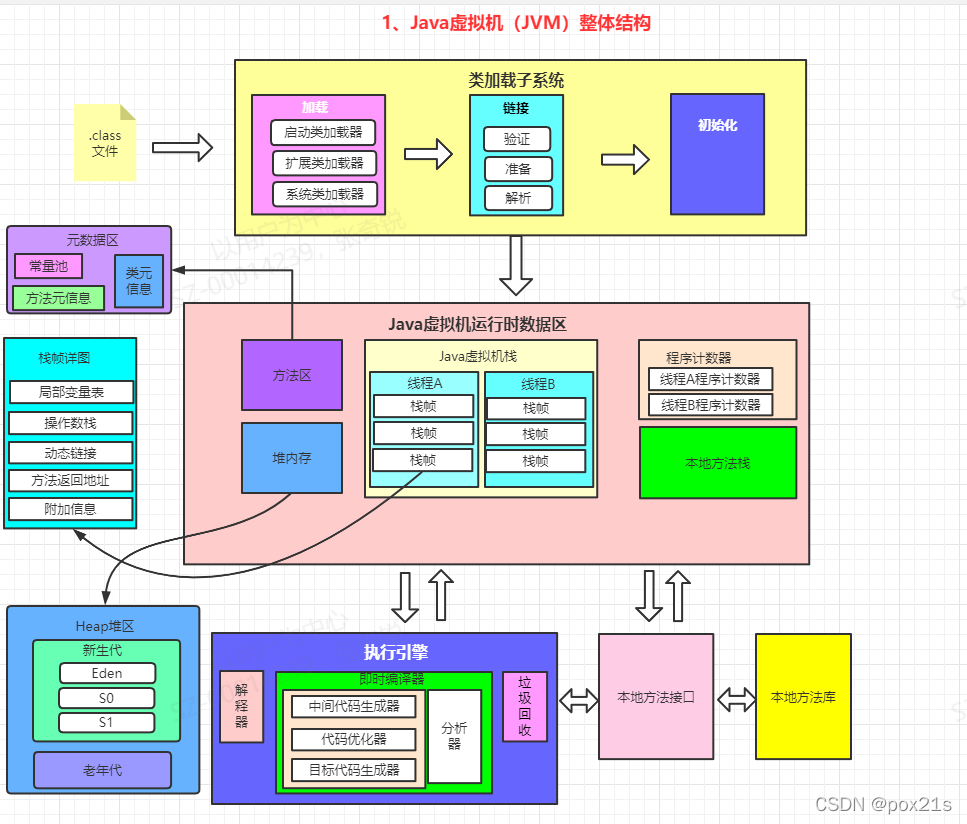

### 一、技术能力复盘 -- Java多线程

##### 1. Java中创建线程的方式有哪些？Thread类和Runnable接口的区别是什么？
- 继承Thread 
- 继承Runnable
- 实现 Callable

区别在于应用场景不同: 主要是考虑到Java的单继承多实现，类只能单继承，接口可以多实现

##### 2. 请解释什么是线程安全，如何在Java中实现线程安全？
> 线程安全主要是同一个资源被多个线程访问情况下， 保证原子操作、有序性、可见性等

Java原生有几个关键字来支持线程安全
- synchronized
- volatile
- final

JUC也基于AQS也实现了一系列的同步机制来增加对线程安全的保证
- ReentrantLock 
- Semaphore
- ReadWriteLock

##### 3.解释一下synchronized关键字和volatile关键字的区别。

`synchronized` 是Java关键字, 支持在方法、静态方法、代码块进行同步标记, 底层通过自旋cas + 操作系统mutex 两个组合实现修饰 代码块/方法 同步锁定，一次只能被一个线程执行，保证了 原子性/有序性  但是可见性不保证

`volatile` 也是Java关键字，支持修饰在类或者实例变量上, 其底层通过内存屏蔽手段 来实现所有对变量的读写都直接发生在主存而不是CPU高速缓存上，从而保证了多线程之间数据的 可见性 但是不保证原子和有序

##### 4. Java中的wait()和notify()方法是如何工作的？它们与notifyAll()有何不同？

wait、notify 都是基于某一个锁对象而来的，wait 方法调用后表示释放持有的对象锁，并进入等待队列, notify 表示唤醒某一个进入wait 的线程  wait 需要持有锁，而notify 不需要持有

##### 5. Java中的ReentrantLock是什么？它与内置锁synchronized有什么区别？

ReentrantLock是基于AQS框架实现的Java语言层面锁，支持资源锁定，支持线程重入，支持非公平特性等， 底层实现是基于AQS框架拓展而来； 相比于sychronized锁，其优势在于使用了无锁的方案, 在并发竞争激烈的情况下，性能更加优异

##### 6. 说说Java线程池的设计, 工作原理
Java 语言为线程池设计了一系列的抽象和模板,最终通过ThreadPoolExecutor 提供常用的线程池实现

 主要涉及的接口有
 1. Executor
 2. ExecutorService
 3. AbstractExecutorService
 4. ThreadPoolExecutor
 
其中Executor 定义了执行标准 execute api 
 
ExecutorService 拓展了 Executor的功能,在执行器基础上增加了线程及任务的管理API，如submit以及对线程池的状态监控及管理

AbstractExecutorService定义了标准的模板抽象，submit的标准和批量执行任务的APIs 

ThreadPoolExecutor 实现了真正任务的包装, 任务执行者的抽象封装

##### 7. Java中的ConcurrentHashMap是如何实现线程安全的？
节点级别锁,针对每一次数据写入操作，区分场景，如果当次失败，进行while重试

- hash表数组不存在，进行初始化
- key不存在，cas 写入更新
- hashtable正在扩容，帮助进行扩容
    - 多线程扩容底层其实是基于 key级别锁定迁移的, 因为进行迁移的时候，对原来的数据进行变更其实是有风险的，会导致更新丢失行为，所以最好方案是参与到迁移或者线程阻塞- 
- 如果需要更新值，则通过 synchronized 关键字进行资源锁定后再进行更新，锁定的范围是 key 级别 

### 二、技术能力复盘 -- Java虚拟机

##### 1. 请解释JVM的主要组成部分?
- 类加载子系统
    - 加载
    - 链接
    - 初始化
- 运行时数据区域
    - 元数据区
    - 虚拟机栈
    - 本地方法栈(具体根据JVM实现看是否和 虚拟机栈分开的)
    - 堆内存
        - 新生代(Eden/S0/S1)
        - 老年代
        
- 虚拟机执行引擎
    

##### 2. 什么是垃圾回收机制? 描述一下Java中的几种垃圾回收器
- Parallel GC: 多线程并行进行垃圾回收
- CMS 适合低延时的系统诉求
    - 老年代CMS
    - 新生代还是ParallelGC
- G1 GC 适合大堆内存的GC

##### 3. 如何监控和分析JVM性能?
- 监控
    - APM 工具等
    - JVM参数配置打印 GC日志/堆dump异常
    - JVM 工具集合 jstat/jstack/jmap
- 分析
    - [JProfiler](https://blog.csdn.net/qq_42262444/article/details/133163454)
    - [GCEasy](https://gceasy.io/)
    - [HeadDump](https://thread.console.heapdump.cn/)

##### 4. 请描述一下常见的JVM性能问题及其解决方法?
- OOM异常或者StackOverFlow异常
    - 进行堆dump后使用内存分析工具
- 垃圾回收频繁
    - YGC 频繁
        - 对象分配速率高：如果应用程序创建对象的速度远大于垃圾回收的清理速度，新生代将迅速填满，触发GC
        - 新生代容量小：默认的新生代大小可能不足以应对应用的需求，特别是在对象创建活动较多的情况下
        - 对象生存时间过长：如果新生代中的对象因为存活时间稍长而未能在多次GC后晋升到老年代，也可能引发频繁的GC
        
        优化方案
        - 增加新生代大小：通过调整-Xmn参数或-XX:NewSize和-XX:MaxNewSize参数来增加新生代的大小，从而提供更多空间以减少GC的频率
        - 优化对象分配：审查和优化代码以减少对象的创建，特别是减少大量临时对象的生成          

    - OldGc频繁
        - 内存泄漏：老年代中的内存泄漏会导致有效空间迅速减少，从而触发频繁的GC。
        - 对象晋升过快：如果新生代的对象过快晋升到老年代，而这些对象并不是长期存活的，也会造成老年代的过度占用
        - 一次性分配了大对象导致新生代装不下(情况少一般是新生代太小)

- CPU 使用率过高 

##### 5. 什么是内存泄露？在Java中如何检测和防止内存泄露？

##### 6. 常见的JVM调优参数有哪些？

### 三、技术能力复盘 -- Java集合框架
##### 1. Java集合框架中`List`、`Set`和`Map`的主要区别是什么？
##### 2. `HashMap`、`Hashtable`和`TreeMap`的区别及应用场景？
##### 3. 请解释`ConcurrentHashMap`的内部工作原理。
##### 4. Java中的`Collections.synchronizedList`和`CopyOnWriteArrayList`的区别是什么？
##### 5. 什么是弱一致性（Weak Consistency）？
##### 6. `Iterator`和`ListIterator`的区别是什么？
##### 7. 如何在Java中安全地遍历一个集合？
##### 8. `LinkedHashMap`和`HashMap`有什么区别？
##### 9. Java 8中引入的`Stream API`如何影响集合操作？
##### 10. 解释Java中的泛型，它在集合框架中如何使用？

### 四、技术能力复盘 -- Java网络IO

##### 1. BIO、NIO和AIO有什么区别？
- BIO blockIO 阻塞式io, 服务器线程监听一个套接字后, 阻塞式监听数据，如果没有数据就一直阻塞在这个套接字上, 有数据后读取一段数据进行数据处理, 然后往发送这段数据的客户端套接字发送数据 
- NIO Non-Block IO 非阻塞IO  就是套接字的监听不会阻塞, 如果没有数据或者数据未准备好, 允许线程提前返回，不需要阻塞在套接字上
- AIO 异步IO 事件驱动 + 非阻塞

##### 2. 什么是Java NIO的通道（Channel）和缓冲区（Buffer）？
- NIO channel 可以理解为一个套接字对的抽象
- 缓冲区

##### 3. 请解释Java中的非阻塞IO是如何工作的。
- 非阻塞IO 底层是操作系统支持IO操作非阻塞 

##### 4. Java中的`Selector`是什么？它是如何用于非阻塞IO的？
- Selector 主要是用于IO 复用的场景, 允许一个Selector监听多个套接字, 将套接字+事件组合后注册到 selector 上, selector 对注册的时间进行轮询操作,
如果事件满足操作条件，则对数据进行后续的回调业务处理
 

##### 5. 如何在Java中创建一个简单的Socket服务器和客户端？
- new ServerSocket(port) 
- serverSocket.accept() ==> 客户端 连接

- SocketChannel.connect()

##### 6. 什么是TCP和UDP？在Java中如何实现它们？
- TCP 传输控制协议  面向连接的可靠协议 传输慢一点、可靠
- UDP 用户数据协议  面向无连接协议  传输快、不可靠

在Java中分别是Channel下的
- SocketChannel
- DatagramChannel

##### 7. 请解释什么是Java的序列化，它在网络编程中有什么用途？
序列化主要是将Java对象序列化为 二进制的计算机传输字节的过程

网络编程中传输层都是基于字节传输的，序列化能够将应用层的Java对象转换成用于计算机传输的字节

##### 8. 如何处理网络超时和重试机制？

##### 9. Java中的SSL/TLS握手是什么？它如何保证网络通信的安全？
