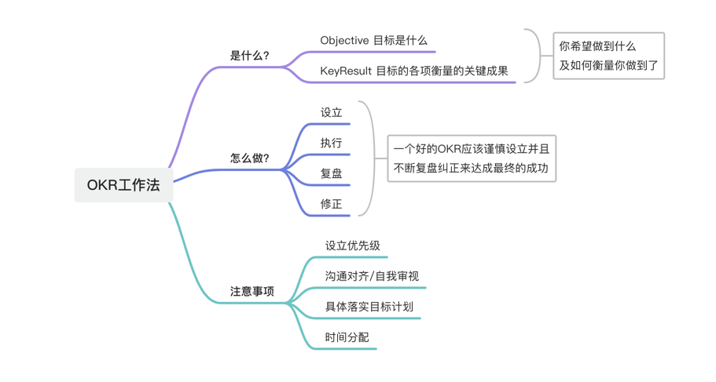

:::info
💡  根据 [遗忘曲线](https://baike.baidu.com/item/%E9%81%97%E5%BF%98%E6%9B%B2%E7%BA%BF/7278665?fr=aladdin)：如果没有记录和回顾，6天后便会忘记75%的内容
      读书笔记正是帮助你记录和回顾的工具，不必拘泥于形式，其核心是：记录、翻看、思考
:::

| **书名** | OKR工作法:谷歌、领英等顶级公司的高效秘籍 |
| --- | --- |
| **作者** | 克里斯蒂娜·沃特克 |
| **状态** | 已读完 |
| **简介** | 
 |

## 全文导读

## 内容总结
### 1、什么是OKR工作法
OKR就是Objectives and Key Results，即目标与关键结果法；OKR工作法是是一种基于目标的管理方法，简单点说就是如何把精力、时间聚焦在最重要的事情上并实现可能完成的最大目标，通俗夸张点说就是达到“你最想做什么基本就能做成什么”的状态; 

- O是Objectives：目标就是你想要做什么事（比如提高阅读水平) 
- KR是Key Results：关键结果，如何证明你的目标完成了？（比如，1.每年阅读100本书; 2.每年写50篇且不少于1500字心得体会）

### 2、如何设定一个好的OKR
#### 一个好的OKR是什么样的？

- 如果你发现一起床就有做事的激情，说明你设置了一个好的目标；如果你看到关键结果时有点担心，那这个关键结果的设置就是恰当的
- 一个好的OKR的目标必须是可衡量的，是有挑战性却又不至于让人绝望的，对于完成它，你大约抱有50%左右的信心
- OKR的时间跨度时间最好是月度/季度/年度，过长如 3-5年则成为了战略，过短如一个星期则成为了一个任务 
#### 如何设定OKR？
在设定OKR之前，先明确个人或团队或企业的使命，它应当简洁、  ，像纲领一样具有指导性，它会提醒你不要把时间消耗在无用的事情上； 如果是一个团队，从OKR的层级上，应自上而下，先设定公司层面的OKR，然后才是部门的OKR，但是个人的OKR可以不需要完全的对齐到部门的OKR；
制定OKR要解决两个问题，一是确定OKR目标，二是确定OKR关键结果

- **第一步: 确定目标**

**设定目标要考虑的两个原则**

   1. 要简单清晰鼓舞人心; 比如个人作为一名程序员: 提升作为程序员的专业能力; 
   2. 要期限适宜，最好以季度为期限，超过1年用使命更恰当，超过3年用战略/梦想更好，低于一个月用任务更合适; 

以这两个标准来评判，把“提高阅读水平”作为目标就不太合适，太平淡，起不到鼓舞作用，改为“让阅读水平实现质的飞跃”或“成为阅读达人”效果更佳。

**确定OKR目标的三个步骤**

   1. 第一步，收集目标。思考近期希望聚焦的目标并罗列出来, 可以有多个目标
   2. 第二步，筛选目标。罗列所有目标, 并对目标进行分类整理融合补充，最终选出1-2个目标， 目标不要一次性设立太多
   3. 第三步，确定目标。对筛选出来的目标进行对应的调整优化，适当的增加难度或减轻难度都是有必要的，因为目标不能过于简单也不能脱离实际；

- **第二步: 确定关键结果**

关键结果是衡量判断目标是否达到的关键指标，**也就是说，只要确定的关键结果达标了，目标就实现了, 所以关键结果一定要紧贴目标, 与目标对应上**。
关键结果确定包括四个方面：

   - **寻找指标, 即找到那些能体现、影响目标实现的要素，越多越好**

有必要头脑风暴(设定个人目标可以通过咨询请教更加有经验的人士来完成这一过程)，把能想到的指标都罗列出来，便于进行分类整。 就拿 “提升作为程序员的专业能力” 这个目标来说，指标可包括技术深度广度编码习惯与设计思想、项目管理能力、技术输出能力，技术团队管理能力等。

   - **确定数量和指标**

对列出的所有指标进行分类整理融合，最终选出最多三个（太多了分散精力、难以聚焦，OKR的力量就在于聚焦;也不能太少，少了难以判断衡量是否可达到目标）。
指标要从不同角度去衡量目标是否完成了, 选出最能体现出目标完成的指标,  并且要根据实际情况来确定，选择那些有困难挑战但是又能够完成的指标；以「提升作为程序员的专业能力」 为例, 指标中  专业技术能力、项目管理能力、技术输出能力，技术团队管理能力中，前三项是能够做到的，第4项因为尚未成为技术团队管理者, 不具备条件，所以实现上是几乎不可能的且无法作出衡量指标的；

   - **量化指标。**

即每个指标达到什么程度能更好体现目标实现了。

   - **设置信心指数**

对每个被量化了的指标，我们有多大信心完成，很容易完成用1表示，根本完成不了用10表示。信心指数不能太低，低没有挑战性，难以提高，也不能太高，高了难以完成，挫伤积极性。设置成5比较合适，即觉得自己全力以赴能完成目标，否则就要调整指标量化的数值。

### 3、 如何实践OKR工作法

1. **要由专门的团队负责OKR**; 没有单独、专门的团队负责跟踪落实，往往会使OKR束之高阁或半途而废。
2. **要聚焦在重要的事情上; **每周工作要明确优先级、要聚焦到关键结果上，关键结果要聚集到目标上，每阶段聚焦一个目标，把时间、精力、人员聚焦在最重要的事情上。
3. **要周一的盘点会;** 团队每周一召开讨论会，用1/4的时间讲述进展，其余时间一起讨论下一步计划，建议开短会。根据四个象限中的内容，主要讨论以下问题：
   - 这个优先级列表能确保我们的OKR完成吗？
   - 我们的能力可以完成OKR吗？谁能帮助我们？
   - 我们准备好新一轮的发力了吗？其他部门知道马上要做什么吗？
   - 我们已经筋疲力尽了吗？我们的系统是否存在什么隐患？
   - 如果OKR设定的信心指数是5/10，那目前完成的概率是更高了还是更低了，原因是什么。
4. **要开好周五的庆功会**;  庆功会主要是调动团队的积极性、参与性，与周一的盘点会不同，庆刚会主要展示部门或个人的成果，比如签下的订单、解决的问题。 
### 4、 OKR实施注意事项

- 没有给目标设置优先级
- 缺乏充分沟通
- 没有做好具体落实目标的计划
- 没有把时间花在重要的事情上
- 轻易放弃
## 读后感
设定自己的OKR
### O1:  提升自身的技术深度、成为Java领域技术专家
#### KR1:  阅读《Java虚拟机规范》《深入理解Java虚拟机-3》书籍，总结Java虚拟机原理及调优文档、完成项目代码整理输出 
#### KR2:  

## 书摘

- 该书的金句摘录...
- 该书的金句摘录...
- 该书的金句摘录...
## 相关资料
> 可通过“⌘+K”插入引用链接，或使用“本地文件”引入源文件。

