# 第一部分、生命周期阶段导图
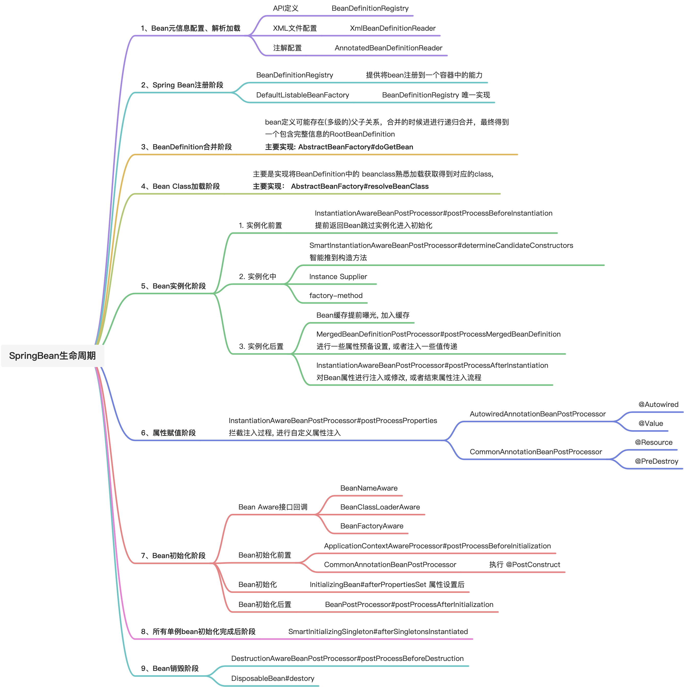

# 第二部分、生命周期阶段详解
## 阶段一、Bean 元信息配置与解析
> **大前提** : Spring Bean 在实例化初始化之前, 其实都是以元对象 - `BeanDefinition` 存在；Spring容器启动的过程中，会将Bean解析成Spring内部的BeanDefinition结构。不管是是通过xml配置文件的<Bean>标签，还是通过注解配置的@Bean，还是@Compontent标注的类，还是扫描得到的类，它最终都会被解析成一个 `BeanDefinition `对象，最后Spring Bean工厂就会根据这份Bean的定义信息，对bean进行实例化、初始化等操作;

### SpringBean 元对象之 BeanDefinition 
> BeanDefinition描述了关于Bean定义的各种信息,  例如: 
> - bean对应的class
> - scope
> - lazy信息
> - dependOn信息
> - autowireCandidate(是否是候选对象)
> - primary(是否是主要的候选者)等信息
> - 是否单例/多例


BeanDefinition是个接口，有几个实现类，看一下类图：
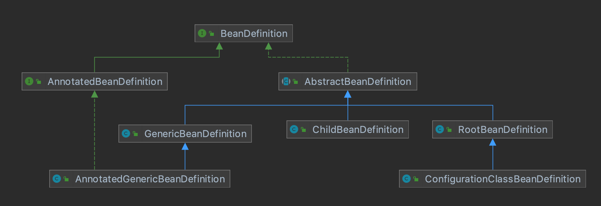
**BeanDefinition 核心分类**

- RootBeanDefinition:   表示根Bean定义的信息, 通常没有父Bean情况下直接使用这个表示
- ChildBeanDefinition:  表示子Bean的定义信息
- GenericBeanDefinition: 通用的Bean定义信息
- ConfigurationClassBeanDefinition:  通过配置类下 `@Bean`  方法定义的Bean的信息
- AnnotationClassBeanDefinition:  通过注解的方式定义

**BeanDefinition 继承了两个接口**

- AttributeAccessor

相当于一种 k-v 的数据结构, 底层是一种LinkedHashMap实现, 用来存储BeanDefinition过程中一些附属信息

- BeanMetadataElement


该接口提供一个  `getResource` 方法, 用于查找BeanDefinition定义的来源
[image.png](https://cdn.nlark.com/yuque/0/2022/png/22746802/1659881128234-c8aa1f65-f8e5-47fd-bcdc-04b696291b2f.png#averageHue=%232e2e2e&clientId=u512fd58a-095c-4&from=paste&height=221&id=rMOX1&originHeight=442&originWidth=1724&originalType=binary&ratio=1&rotation=0&showTitle=false&size=26702&status=done&style=none&taskId=u7591bc23-2738-4034-92e6-e7bfb758063&title=&width=862)
### Bean元信息配置与加载 3 种方式
#### 1. 基于XML
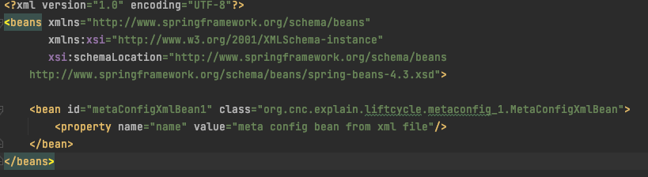
基于配置的容器启动过程如下,  本质上起来的是一个  `FileSystemXmlApplicationContext`对象
```java
public void testConfigBeanFromXml() {
    FileSystemXmlApplicationContext ctx = new FileSystemXmlApplicationContext("classpath:step1.xml");
    MetaConfigXmlBean bean = ctx.getBean(MetaConfigXmlBean.class);
    System.out.println(bean);
}
```
加载则是通过 `XmlBeanDefinitionReader`  进行相关文件的解析读取
```java
public void testParseFromXmlFile() {
    DefaultListableBeanFactory factory = new DefaultListableBeanFactory();
    XmlBeanDefinitionReader reader = new XmlBeanDefinitionReader(factory);
    int count = reader.loadBeanDefinitions(new ClassPathResource("step1.xml"));
    System.out.println("total load " + count + " bean definitions");

    for (String definitionName : factory.getBeanDefinitionNames()) {
        BeanDefinition definition = factory.getBeanDefinition(definitionName);
        System.out.println(definition);
    }
}
// 通过XML配置解析出来的BeanDefinition都是 `GenericBeanDefinition` 类型
// 输出
Generic bean: class [org.cnc.explain.liftcycle.beanparse_2.ParsedXmlBean]; scope=; abstract=false; lazyInit=false; autowireMode=0; dependencyCheck=0; autowireCandidate=true; primary=false; factoryBeanName=null; factoryMethodName=null; initMethodName=null; destroyMethodName=null; defined in class path resource [step2.xml]

Generic bean: class [org.cnc.explain.liftcycle.beanparse_2.ParsedXmlBean]; scope=; abstract=false; lazyInit=false; autowireMode=0; dependencyCheck=0; autowireCandidate=true; primary=false; factoryBeanName=null; factoryMethodName=null; initMethodName=null; destroyMethodName=null; defined in class path resource [step2.xml]

```

#### 2. 基于注解
基于注解的容器启动由 `AnnotationConfigApplciationContext`完成
```java
@Component/@Service/@Repositry 
public class TestBean{
}
// 方式二、通过@Configuration 标准的配置加载
@Configuration
public class AppConfiguration{
    @Bean
    public TestBean  testBean(){return new TestBean();}
}
//方式一、bean类上加对应的注解 这种需要采用注解 @ComponentScan扫描
@Test 
public void testConfigurationFromAnnotation(){ 
    AnnotationConfigApplicationContext ctx = new AnnotationConfigApplciationContext(AppConfiguraion.class);
    TestBean tb = ctx.getBean(TestBean.class);
}

```
解析交由给 `AnnotatedBeanDefinitionReader`完成
```java

public void testParseFromAnnotationConfiguration() {
    DefaultListableBeanFactory factory = new DefaultListableBeanFactory();
    AnnotatedBeanDefinitionReader reader = new AnnotatedBeanDefinitionReader(factory);
    // 注册到 bean-factory
    reader.register(MetaConfigBean.class);
       
    // 循环的获取BeanDefinition
    for(String beanDefinitionName : reader.getRegistry().getBeanDefinitionNames()){
        BeanDefinition definition = reader.getRegistry().getBeanDefinition(beanDefinitionName);
        System.out.println(definition);
        System.out.println(definition.getClass().getName());
    }
}
```
此外, 通过注解形式手动进行bean注册解析, 能够解析出 Bean 类上添加的一些关于BeanDefinition的注解,  `@ComponentScan` 就是基于这个做的扫描与注册, 底层的调用就是  `private <T> void AnnotatedBeanDefinitionReader#doRegisterBean` 方法, 创建一个 `AnnotationGenericBeanDefinition`  对象,  然后注册到内部的  `**BeanFactory**`** **工厂中** **中 
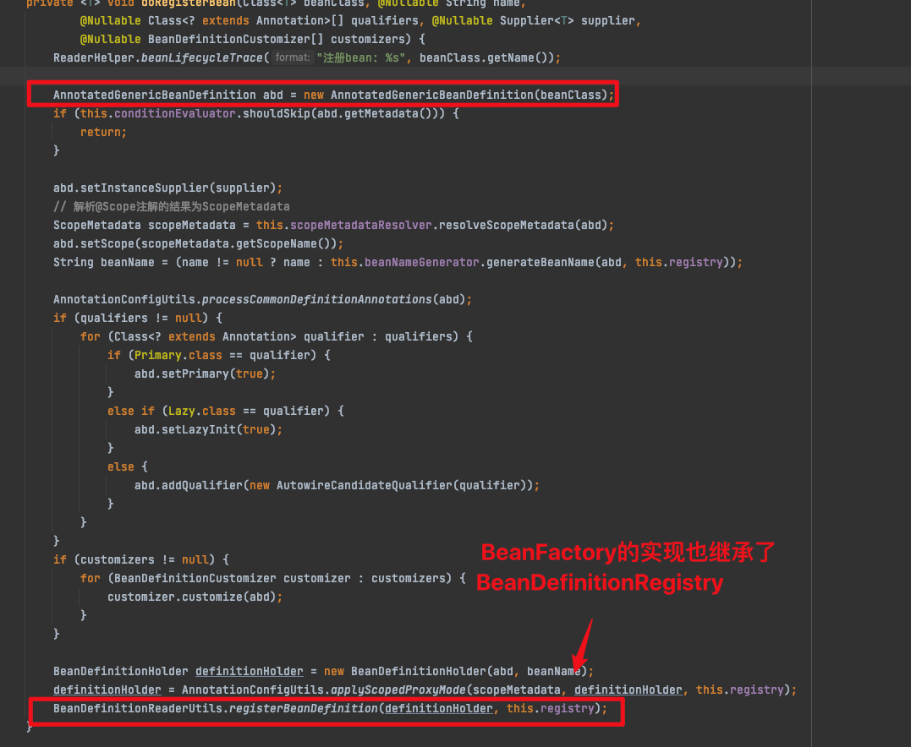

看一下输出情况,  符合预期
```java
// bean 
@Component
@Primary
@Scope("prototype")
@Lazy
public class ParsedAnnotationBean{}

输出 >>> 
// BeanDefinition内容, 可以看到  scope、lazyInit、primary 等信息是配置的那样
Generic bean: class [org.cnc.spring.explain.configbean.MetaConfigBean]; scope=prototype; abstract=false; lazyInit=true; autowireMode=0; dependencyCheck=0; autowireCandidate=true; primary=true; factoryBeanName=null; factoryMethodName=null; initMethodName=null; destroyMethodName=null
// BeanDefinition
org.springframework.beans.factory.annotation.AnnotatedGenericBeanDefinition
```

**需要特别关注 **
> 基于 手动注解注入无法完成依赖注入, 也就是说通过 @Resoure或者@Autowired 标记的属性无法正常注入,   具体原因是因为依赖注入是需要依靠 `AutowiredAnnotationBeanPostProcessor`  和 `CommonAnnotationBeanPostProcessor`两个 **BeanPostProcessor** 完成处理的

```java
public class ParsedAnnotationDependenceBean{}

public class ParsedAnnotationBean {
	@Autowired
	ParsedAnnotationDependenceBean parsedAnnotationDependenceBeanAutowired;
	@Resource
	ParsedAnnotationDependenceBean parsedAnnotationDependenceBeanResource;
}

public void testParseFromAnnotationConfiguration() {
    DefaultListableBeanFactory factory = new DefaultListableBeanFactory();
    AnnotatedBeanDefinitionReader reader = new AnnotatedBeanDefinitionReader(factory);

    //注册注解处理器
    factory.addBeanPostProcessor(factory.getBean(CommonAnnotationBeanPostProcessor.class));
    factory.addBeanPostProcessor(factory.getBean(AutowiredAnnotationBeanPostProcessor.class));

    // 注册到 bean-factory
    reader.register(ParsedAnnotationDependenceBean.class);		//  被依赖bean
    reader.register(ParsedAnnotationBean.class); 				//  主bean
    
    ParsedAnnotationBean bean = factory.getBean(ParsedAnnotationBean.class);
}
```

#### 3. 基于API
基于API的方式则是通过手动创建一个 `BeanDefinition` 对象,注册到一个`BeanDefinitionRegistry` 中
```java
@Test
public void testConfigBeanFromBuilderApi() {
    // assign the bean name
    BeanDefinitionBuilder builder = BeanDefinitionBuilder.rootBeanDefinition(MetaConfigBean.class.getName());
    builder.addPropertyValue("name", "config from the builder API");
    BeanDefinition bd = builder.getBeanDefinition();
    // 创建spring 容器
    DefaultListableBeanFactory factory = new DefaultListableBeanFactory();
    // 调用registryBeanDefinition向容器中注册bean
    final String beanName = "metaConfigApiBean";
    factory.registerBeanDefinition(beanName, bd);

    // 获取bean
    MetaConfigBean bean = factory.getBean(beanName, MetaConfigBean.class);
    System.out.println(bean);
}
```

## 阶段二、Spring Bean注册阶段
> **首先明确一点, SpringBean注册其实可以认为就是 **`**BeanDefinition**`**的注册; **     
> 

这里就会涉及到一个关键的接口: `BeanDefinitionRegistry`**,** Spring Bean注册将解析好的Bean注册到Bean注册器/Bean工厂内, 在Spring整体框架内一些核心的BeanFactory实现了BeanDefinitionRegistry接口, 代表支持将BeanDefinition注册到对应的BeanFactory容器中, 看一下类图
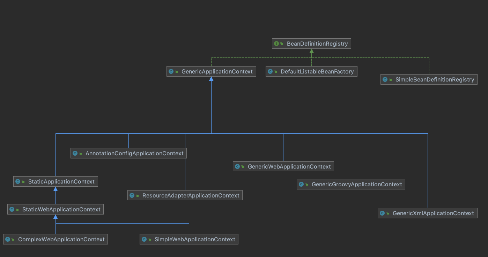
BeanDefinition 接口有三个直接的实现类

- **GenericApplicationContext**:  这个是主要核心 `SpringApplicationContext`  父类, 可以看到很多重要的ApplicationContext都实现了这个类,  但是这个类不对 BeanDefinitionRegistry做具体实现，BeanDefinition注册相关的能力都委托给 DefaultListableBeanFactory

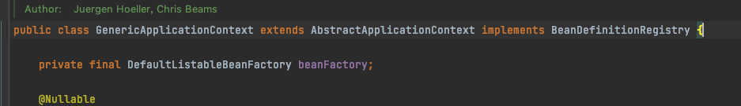

- **DefaultListableBeanFactory** :  BeanDefinitionRegistry 的`唯一使用到`实现, BeanDefinitionRegistry的主要能力都由这个类实现
- **SimpleBeanDefinitionRegistry**:  只在测试使用
:::success
**结论:  DefaultListableBeanFactory 是 BeanDefinitionRegistry 的唯一实现**
:::


**DefaultListableBeanFactory **实现了 BeanFactory 也印证了注册BeanDefinition相当于注册Bean的说法,  当然具体Bean的生成和存储还是会有更多细节； Spring官方对此也有佐证，比如基于 Annotation 配置的Bean最终会走到 `org.springframework.context.annotation.AnnotatedBeanDefinitionReader#doRegisterBean` 方法,   实际上方法内注册是 `**BeanDefinition**`
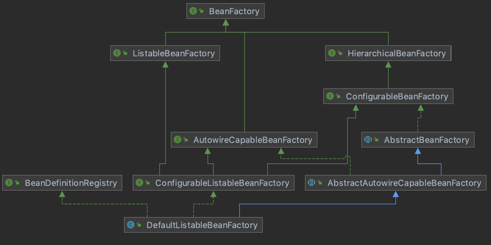

测试下注册一个BeanDefinition 到 Registry, Factory有了BeanDefinition 就可以通过 getBean 去惰性的加载并获取一个Bean对象了
```java
@Test
public void testBeanDefinitionRegistry() {
    DefaultListableBeanFactory beanFactory = new DefaultListableBeanFactory();
    // 定义一个 bean definition
    GenericBeanDefinition gbd = new GenericBeanDefinition();
    gbd.setBeanClass(BeanDefinitionRegistryBean.class);
    // 注册
    beanFactory.registerBeanDefinition("bean", gbd);
    System.out.println(beanFactory.getBeanDefinition("bean"));
    System.out.println(beanFactory.containsBeanDefinition("bean"));
    System.out.println(Arrays.asList(beanFactory.getBeanDefinitionNames()));
    
    /**
    *  核心重点在 getBean的内部调用方法: {@link org.springframework.beans.factory.support.AbstractBeanFactory#doGetBean}
    */
    BeanDefinitionRegistryBean bean = beanFactory.getBean(BeanDefinitionRegistryBean.class);
}
```

这个阶段在Spring的代码流程中，分别对应

- XML 配置： `org.springframework.context.support.AbstractApplicationContext#obtainFreshBeanFactory`
- Annotation配置 :  `org.springframework.context.annotation.AnnotatedBeanDefinitionReader#doRegisterBean`

有兴趣可以代码追踪, 最终会在  `org.springframework.context.support.AbstractApplicationContext#refresh` 这个方法集合
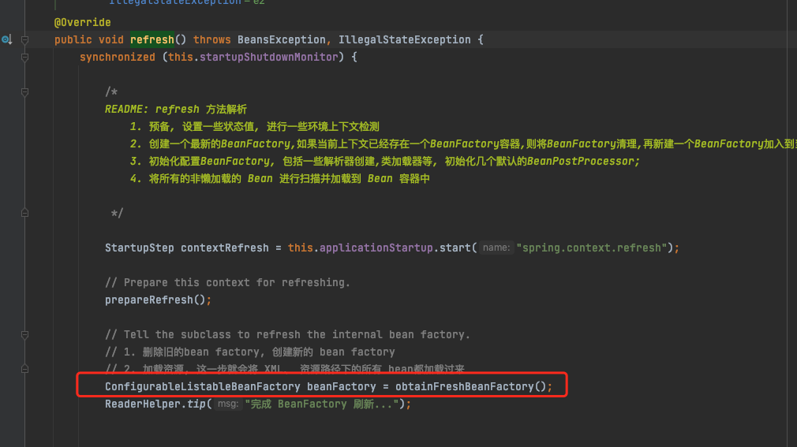

## 阶段三、BeanDefinition合并阶段
> 一些场景下, 可能存在一些父子Bean的场景, Bean的一些set配置存在父级时, 就需要对Bean进行一个父子合并，才能得到一个完整的子Bean对象, 这个阶段是将父bean的BeanDefinition与子 bean的BeanDefinition进行合并，最终得到一个包含完整信息的 RootBeanDefinition; 

具体进行 BeanDefinition 合并的地方在 `org.springframework.beans.factory.support.AbstractBeanFactory#doGetBean`
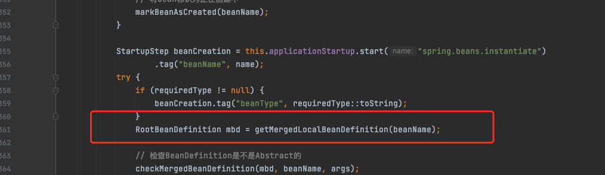
下一级完成这个步骤的方法是: `org.springframework.beans.factory.support.AbstractBeanFactory#getMergedBeanDefinition`
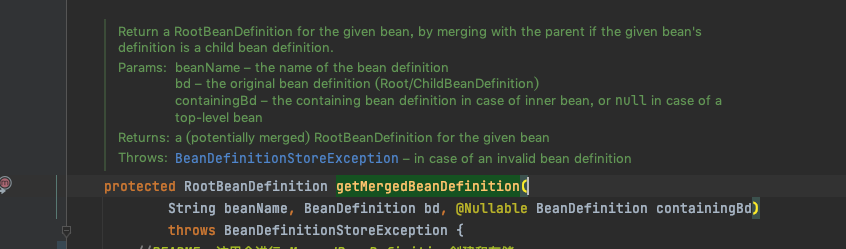
追踪往下可以看到完成的地方是在 `org.springframework.beans.factory.support.AbstractBeanDefinition#overrideFrom`, 很明显可以看出，所谓的合并BeanDefinition其实就是 子BeanDefinition 覆盖 父BeanDefinition的属性, 如: `Scope`,`Primary`等; 最终返回的父BeanDefinition就是完整的RootBeanDefinition;
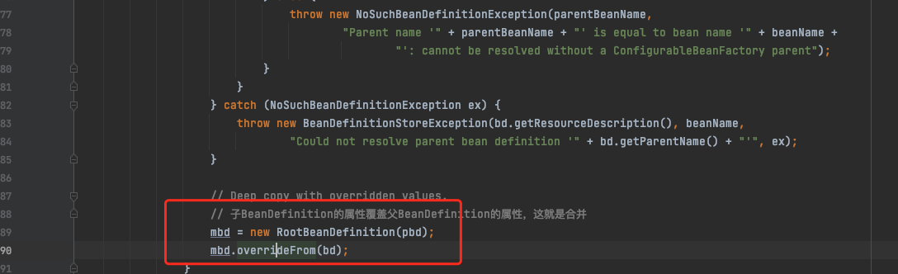

> ⚠️  **注意 **:  很多时候, `AbstractBeanFactory#doGetBean`方法会作为创建bean的一个入口 , SpringBean  懒加载和非懒加载, 默认是非懒加载的
> - 非懒加载的 Bean 会在容器刷新阶段进行加载 , 具体地点是`org.springframework.context.support.AbstractApplicationContext#refresh`方法内对 `finishBeanFactoryInitialization(beanFactory)` 的调用, 深入查看可以看到这个方法内部最终还是会到  `doGetBean`方法


## 阶段四、Bean Class加载阶段
在`AbstractBeanDefinition` 中有一个属性 `private volatile Object beanClass`, 初始化时是一个字符串类型的BeanName, 在Bean的生命周期过程中, 通过 `AbstractBeanFactory#resolveBeanClass`方法将对应的BeanName转换为加载的Class对象, 然后设置到对应的BeanDefinition中去, 这个步骤发生在`AbstractAutowireCapableBeanFactory#createBean` 方法中
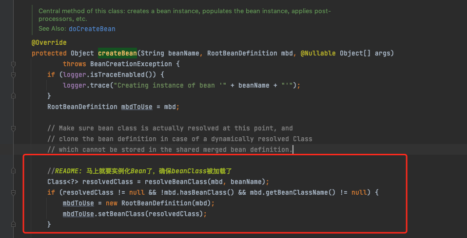

## 阶段五、Bean实例化过程
### 实例化前置
Spring 在Bean实例化前提供了一个 实例化前置 AwarePostProcessor, 允许提前返回一个手动创建的bean, 这样可以绕过 Spring 容器的创建而手动创建对应的Bean;  这个步骤发生在Bean实例化前,  具体的代码位置在`AbstractAutowireCapableBeanFactory#createBean` 对 `AbstractAutowireCapableBeanFactory#resolveBeforeInstantiation`的调用
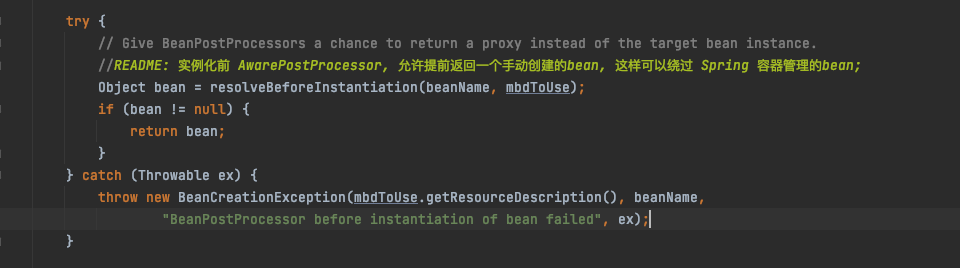
该方法内部会先执行实例化前置拦截BeanPostProcessor方法: `InstantiationAwareBeanPostProcessor#postProcessBeforeInstantiation`, 如果有一个前置处理返回了一个不为空的对象, 那么就会终止前置处理, 并跳过后续的Bean实例化过程,  直接进入到  **初始化后后置**处理阶段`AutowireCapableBeanFactory#applyBeanPostProcessorsAfterInitialization`

可以自己实现一个`InstantiationAwareBeanPostProcessor`来对所有用户Bean进行拦截处理
```java
@Component
public class MyInstantiationAwareBeanPostProcessor implements InstantiationAwareBeanPostProcessor {
	@Override
	public Object postProcessBeforeInstantiation(Class<?> beanClass, String beanName) throws BeansException {
		// 进行实例化前置拦截, 可以在这个阶段返回一个初始化好的Bean
		if(ConditionOnCase){
			return new AlreadyBean();
		}
		return InstantiationAwareBeanPostProcessor.super.postProcessBeforeInstantiation(beanClass, beanName);
	}
}
```
### 实例化中
整个实例化中再Spring中体现在: `AbstractAutowireCapableBeanFactory#createBeanInstance`
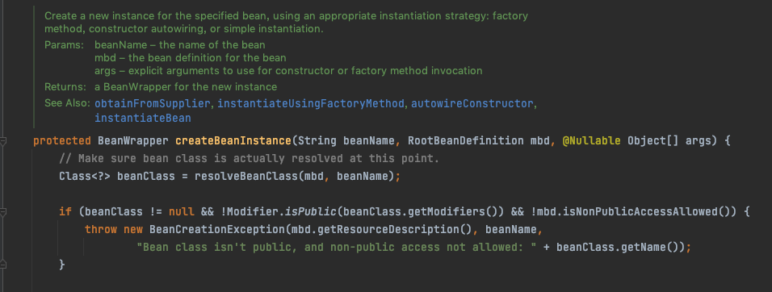
这个方法是整个SpringBean 对象实例化的过程体现, 包括以下核心的体现

- 构造方法推断过程
- **构造方法有参数情况下 自动注入的实现** : 在方法`AbstractAutowireCapableBeanFactory#autowireConstructor`, 基于Bean工厂注入策略有不同

针对构造方法的推断Spring也提供了对应的拓展: `SmartInstantiationAwareBeanPostProcessor` , 能够拦截构造方法推断过程, 自定义构造方法选择逻辑
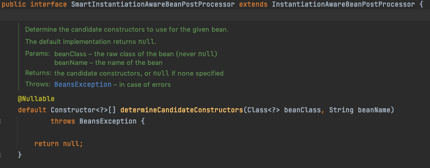
以下两种情况输出结果是完全不同的
```java
// 参照Bean
public class BeanInstanceBean {

	private BeanInstanceConstructInjectBean beanInstanceConstructInjectBean;
	public BeanInstanceBean(BeanInstanceConstructInjectBean beanInstanceConstructInjectBean) {
		this.beanInstanceConstructInjectBean = beanInstanceConstructInjectBean;
	}
	public BeanInstanceBean() {}
}

// 构造推导插件
public class MySmartInstantiationAwareBeanPostProcessor implements SmartInstantiationAwareBeanPostProcessor {

	@Override
	public Constructor<?>[] determineCandidateConstructors(Class<?> beanClass, String beanName) throws BeansException {
		if(BeanInstanceBean.class.equals(beanClass)){
			Constructor<?>[] constructors = beanClass.getDeclaredConstructors();
			for(Constructor<?> c:constructors){
				if(c.getParameterTypes().length !=0){ // 返回一个参数的
					return new Constructor[]{c};
				}
			}
		}
		return SmartInstantiationAwareBeanPostProcessor.super.determineCandidateConstructors(beanClass, beanName);
	}
}

@Test
public void testMySmartInstantiationAwareBeanPostProcessor(){
    AnnotationConfigApplicationContext ctx = new AnnotationConfigApplicationContext(BeanInstanceConfiguration.class);
    ctx.register(BeanInstanceBean.class);
    BeanInstanceBean bean = ctx.getBean(BeanInstanceBean.class);
    System.out.println(bean);
}    
//output1: 
// BeanInstanceBean{beanInstanceConstructInjectBean=null}

@Test
public void testMySmartInstantiationAwareBeanPostProcessor(){
    AnnotationConfigApplicationContext ctx = new AnnotationConfigApplicationContext(BeanInstanceConfiguration.class);
    ctx.getBeanFactory().addBeanPostProcessor(new MySmartInstantiationAwareBeanPostProcessor());
    ctx.register(BeanInstanceBean.class);
    BeanInstanceBean bean = ctx.getBean(BeanInstanceBean.class);
    System.out.println(bean);
}
//output2: 	BeanInstanceBean{beanInstanceConstructInjectBean=org.cnc.explain.liftcycle.beaninstance_6.BeanInstanceConstructInjectBean@2c1b194a} 

```

此外，还提供了BeanDefinition级别的两个入口,能够拦截到实例化,提供一个bean实例返回, **使用场景逐渐被放弃**

- Instance Supplier  
- factory-method
### 实例化后置
Spring在Bean对象的实例化完成后, 还会进行**三个**核心的操作
#### 1、 Bean缓存提前曝光
将Bean对象加入到三级缓存`**singletonFactories**`中去,  这个时候将创建中的对象提前曝光到工厂集合中, 后续有同样的方法来执行`doGetBean`操作会提前走到三级缓存,  就可以在互斥的锁情况下进行对象的同步创建了
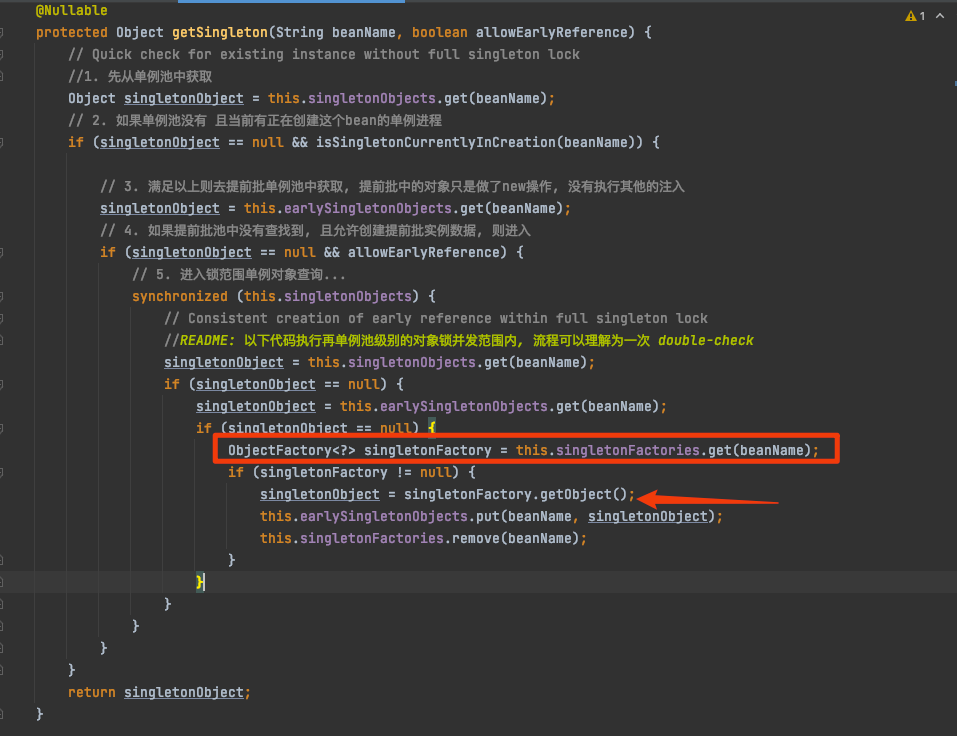
#### 2、 MergedBeanDefinitionPostProcessor
进行实例化的后置的 `**MergedBeanDefinitionPostProcessor#postProcessorMergedBeanDefinition**`处理
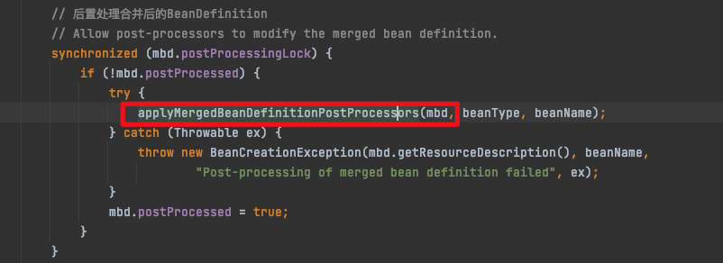
默认情况下,  Spring只添加了`ApplicationListenerDetector` 这一个Processor, 这个processor 用于收集那些实现了 `ApplicationListener`的Bean, 算是对Spring事件驱动模型的一种支持;  
这个阶段可以做的事情比较多, 但是比较突出的机制是:  对已经完成父子合并的BeanDefinition进行一次后置处理,  后续的多个步骤如属性设置, 初始化等都会依赖这个MergedBeanDefinition; 
**可以通过多个实现Processor收集一些元信息在Bean的生命周期各个阶段进行应用,  但是场景少见**
**针对这个用法，目前没有很好的应用场景， 待发掘中...**
#### 3、 实例化后置 postProcessorAfterInstantiation 
在进入正在的属性设置前, Spring提供了一个实例化后置处理入口: `InstantiationAwareBeanPostProcessor#postProcessAfterInstantiation`,  这个方法执行的地点在:  `AbstractAutowireCapableBeanFactory#populateBean`, 主要的作用有

- 提前对字段进行注入或者修改等
```java
public class MyAfterInstantiationAwareBeanPostProcessor implements InstantiationAwareBeanPostProcessor {

    @Override
    public boolean postProcessAfterInstantiation(Object bean, String beanName) throws BeansException {
        if("beanInstanceBean".equals(beanName)){
            BeanInstanceBean ob = (BeanInstanceBean) bean;
            ob.setBeanInstanceConstructInjectBean(
                new BeanInstanceConstructInjectBean("changed by postProcessAfterInstantiation")
            );
        }
        return InstantiationAwareBeanPostProcessor.super.postProcessAfterInstantiation(bean, beanName);
    }
}
// 输出
BeanInstanceBean{
    beanInstanceConstructInjectBeanAutowired=BeanInstanceConstructInjectBean{name='null'}
beanInstanceConstructInjectBean=BeanInstanceConstructInjectBean{name='changed by postProcessAfterInstantiation'}
    }
```

- 通过返回false提前结束字段注入工作
```java
public class MyAfterInstantiationAwareBeanPostProcessor implements InstantiationAwareBeanPostProcessor {
    @Override
    public boolean postProcessAfterInstantiation(Object bean, String beanName) throws BeansException {
        if("beanInstanceBean".equals(beanName)){
            return false;
        }
        return InstantiationAwareBeanPostProcessor.super.postProcessAfterInstantiation(bean, beanName);
    }
}
//输出
BeanInstanceBean{
    beanInstanceConstructInjectBeanAutowired=null
    beanInstanceConstructInjectBean=null
    }
```
> 因为这个阶段的拦截得倒的是一个未进行属性注入的Bean对象,  对Bean的改造会有所限制


## 阶段六、Bean属性设置阶段
Spring Bean的属性设置阶段核心发生在`AbstractAutowireCapableBeanFactory#populateBean`
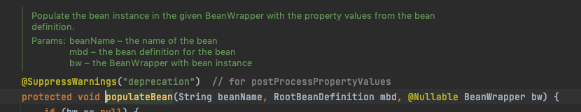
这个阶段主要的工作就是:  对Bean的属性进行设置,  **同样就包括了对于Bean属性的依赖注入,  我们常知的@Autowired  和 @Resource 就是这个阶段进行注入的;**
概括来讲, 这个阶段可以分为两个步骤

1. 通过 @Autowird 或者 @Resource 注入
2.  属性值的应用
###  @Autowird 或者 @Resource 注入
整个的代码执行在 `AbstractAutowireCapableBeanFactory#populateBean`方法内,  这个阶段通过一个 `InstantiationAwareBeanPostProcessor`进行一次拦截处理, 完成属性的注入
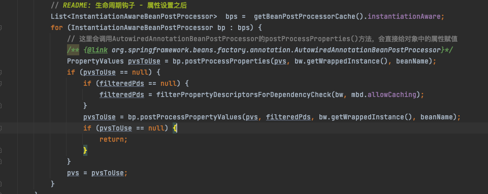
默认情况下, Spring 会在初始化容器阶段注入三个标准的 `InstantiationAwareBeanPostProcessor`:

这个阶段比较重要的是后面的两个

- **CommonAnnotationBeanPostProcesor**

这个类主要是Spring 实现用来支持 JSR-250 标准的; 
在这个阶段这个Processor 核心处理的是 `@Resource` 注解的注入

- **AutowirdAnnotationBeanPostProcessor**

这个类Spring 主要是用来提供Spring标准的注入注解处理以及 JSR-330的部分注解支持; 
在这个阶段这个Processor 核心处理的是 `@Autowired` 注解的注入, 当然这个注解还提供了对 `@Value`  和 `@Inject` 的支持

同时可以直接实现一个 `InstantiationAwareBeanPostProcessor` 对属性设置前置的处理, 进行属性拦截自定义等;
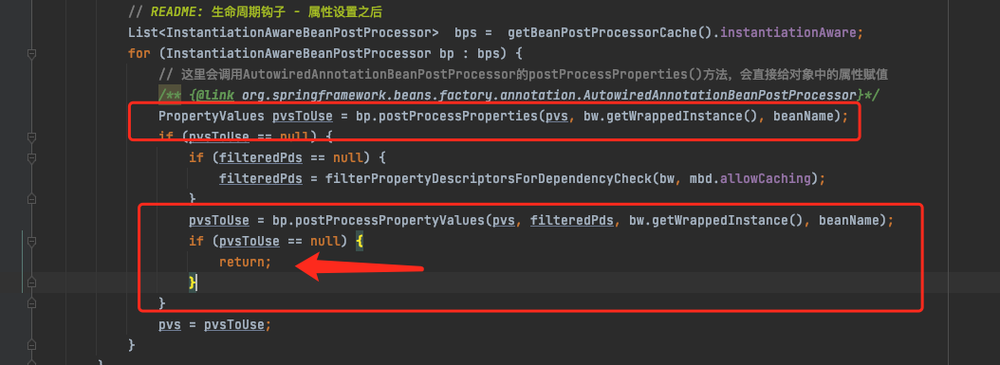
特别需要注意的是, 这个阶段分别调用了两个钩子函数 : 

- `**postProcessProperties**`
- `**postProcessPropertyValues **`** **

其中 `postProcessPropertyValues` 已经被官方标记为弃用了,  内部很多实现都已经转向调用 `postProcessorProperties` 了, 不建议使用这种方式
因为 使用`postProcessPropertyValues` 返回一个`null` 就会导致属性设置提前结束,进入到初始化缓解, 在这里看起来毫无意义

### 属性值的应用
这里就是属性的应用了, 先将属性依赖注入值解析成 PropertyValues对象, 然后通过循环的调用反射set 对属性值进行设定
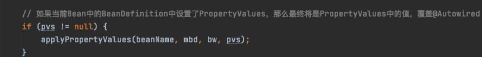

## 阶段七、Bean初始化阶段
Spring 的初始化整个可以理解为围绕着执行初始化方法这个动作, 以及这个动作前后发生的一系列调用, 整个方法的执行在 `AbstractAutowireCapableBeanFactory#initializeBean`
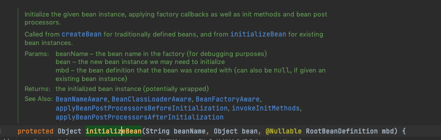
### BeanAware回调阶段
初始化对BeanAware相关方法的回调发生在 `AbstractAutowireCapableBeanFactory#invokeAwareMethods`, 在这个阶段会依次对三个Aware接口进行回调

1. BeanNameAware
2. BeanClassLoaderAware
3. BeanClassLoaderAware

简单示例下: 
```java
public class BeanAwareBean implements BeanNameAware, BeanFactoryAware, BeanClassLoaderAware {
	@Override
	public void setBeanClassLoader(ClassLoader classLoader) {
		System.out.println("call BeanClassLoaderAware method");
	}
	@Override
	public void setBeanFactory(BeanFactory beanFactory) throws BeansException {
		System.out.println("call BeanFactoryAware method");
	}
	@Override
	public void setBeanName(String name) {
		System.out.println("call BeanNameAware method");
	}
}


@Test
public void testBeanAwareBeanCallbacks() {
    AnnotationConfigApplicationContext ctx = new AnnotationConfigApplicationContext(BeanInitConfiguration.class);
    ctx.register(BeanAwareBean.class);
    System.out.println("完成bean注入");
    BeanAwareBean bean = ctx.getBean(BeanAwareBean.class);
    System.out.println(bean);
}
// 输出
完成bean注入
call BeanNameAware method
call BeanClassLoaderAware method
call BeanFactoryAware method
org.cnc.explain.lifecycle.beaninitial_8.BeanAwareBean@31fa1761
```
> 有一个小细节:   通过factory/application 手动注册进去的Bean只是注册了Beandefinition, 真正发生Bean初始化是在`getBean`时, 通过XML或Annotation加载的则不一样, 因为在Applicaiton `refresh`阶段则会加载所有的`**非懒加载Bean**`
> 


对Aware 相关方法支持在这个阶段做一些自定义注入或者缓存之类的
### Bean初始化前置
初始化前置就是在初始化方法执行前的一系列回调,  主要是调用`BeanPostProcessor#postProcessorBeforeInitialization`这个回调, 默认情况下会包含6个基本的Processor 
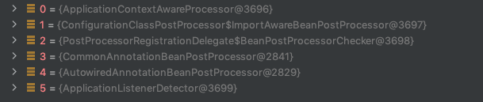
但是实际上,只有 `ApplicationContextAwareProcessor` 在这个的实现有实际的作用,  具体代码可以看`ApplicationContextAwareProcessor#postProcessBeforeInitialization`
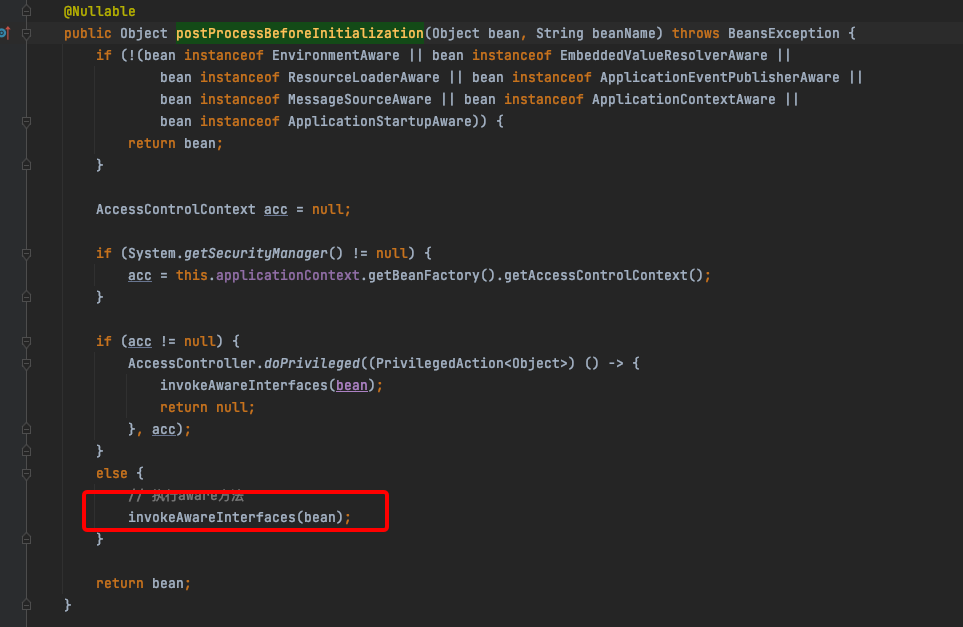
这里有个重点是会执行一些 `Aware` 的接口

- EnvironmentAware
- EmbeddedValueResolverAware
- ResourceLoaderAware
- ApplicationEventPublisherAware
- MessageSourceAware
- ApplicationStartupAware
- ApplicationContextAware

比较常用的就是 `ApplicationContextAware`一般会用来作为一个通用的 Bean 管理工具, 提供一个ApplicationContext 的getBean 入口
```java
class BeanHolder implements ApplicationContextAware{
    private ApplicationContext applicationContext;
    public void setApplicationContext(ApplicationContext ctx){
        this.applicationContext = ctx;
    }
    public T getBean(Class<T> type){
        return applicationContext.getBean();
    }
}
```

### Bean初始化
初始化过程就是执行选择的执行初始化方法, Spring 支持的指定Bean的初始化方法的三种方法

1. 基于XML配置指定 `init-method` 
2. 基于注解 @Bean(initMethod="xx")
3. 通过手动注入初始化方法属性到  `AbstractBeanDefinition#initMethodName` 

这三种方法从根本上来说是互相独立的,   因为配置Bean的方式是不同的入口

Spring 执行 Bean初始化的整个过程发生在 `AbstractAutowireCapableBeanFactory#invokeInitMethods`
需要特别注意的, 在执行真正的初始化方法之前, 会去执行一个属性设置完成后置调用: `InitializingBean#afterPropertiesSet`,  这个回调提供了一次初始化执行前对Bean的属性进行修改的机会,   **但是需要注意这个方法的执行的阶段处在初始化方法执行之前**
可以做一个简单的测试
```java
public class PriorityAfterPropertiesSetAndInitMethodBean implements InitializingBean {
	private String name;

	@Override
	public void afterPropertiesSet() throws Exception {
		this.name = "from propertiesSet";
		System.out.println("InitializingBean # afterPropertiesSet invoke");
	}
	public void initMethod(){
		this.name = "from init method";
		System.out.println("init method invoke");
	}

	@Override
	public String toString() {
		return "PriorityAfterPropertiesSetAndInitMethodBean{" +
				"name='" + name + '\'' +
				'}';
	}
}
@Bean(initMethod = "initMethod")
public PriorityAfterPropertiesSetAndInitMethodBean priorityAfterPropertiesSetAndInitMethodBean(){
    return new PriorityAfterPropertiesSetAndInitMethodBean();
}
@Test
public void testPriorityAfterPropertiesSetAndInitMethod(){
    AnnotationConfigApplicationContext ctx = new AnnotationConfigApplicationContext(BeanInitConfiguration.class);
    PriorityAfterPropertiesSetAndInitMethodBean bean = ctx.getBean(PriorityAfterPropertiesSetAndInitMethodBean.class);
    System.out.println(bean);
}

//输出
InitializingBean # afterPropertiesSet invoke
init method invoke
```
之后就是执行具体的初始化方法`AbstractAutowireCapableBeanFactory#invokeCustomInitMethod`, 就是简单的通过反射获取对应的方法去执行
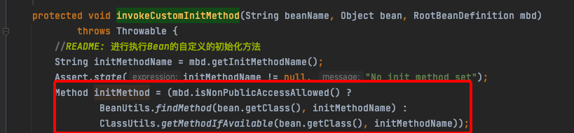

### Bean初始化后置
Spring Bean的初始化后置主要是执行了一次后置回调: `BeanPostProcessor#postProcessAfterInitialization`
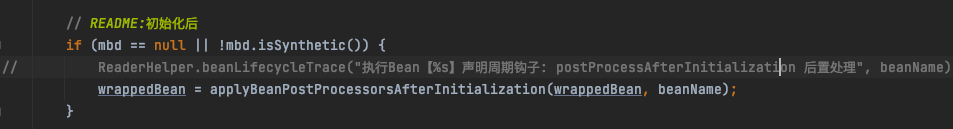
可以看到,  这个回调方法返回的是一个bean对象, 所以可以在这个阶段对 bean进行定制化改造, 甚至是返回一个全新的bean
简单测试一下
```java
public class PostProcessAfterInitializationBean {
	private String name;
	public PostProcessAfterInitializationBean() {
		name = "default";
	}
	public void setName(String name) {
		this.name = name;
	}
	@Override
	public String toString() {
		return "PostProcessAfterInitializationBean{" +
				"name='" + name + '\'' +
				'}';
	}
}
-- 测试修改属性
@Test
public void testChangeBeanPropertiesByPostProcessAfterInitialization(){
	AnnotationConfigApplicationContext ctx = new AnnotationConfigApplicationContext(BeanInitConfiguration.class);
	ctx.getBeanFactory().addBeanPostProcessor(
			new BeanPostProcessor() {
				@Override
				public Object postProcessAfterInitialization(Object bean, String beanName) throws BeansException {
					if("postProcessAfterInitializationBean".equals(beanName)){
						try {
							Method method = bean.getClass().getMethod("setName",String.class);
							method.invoke(bean,"from postProcessAfterInitializationBean");
						} catch (NoSuchMethodException | IllegalAccessException | InvocationTargetException e) {
							e.printStackTrace();
						}
					}
					return BeanPostProcessor.super.postProcessAfterInitialization(bean, beanName);
				}
			}
	);
	ctx.register(PostProcessAfterInitializationBean.class);
	PostProcessAfterInitializationBean bean = ctx.getBean(PostProcessAfterInitializationBean.class);
	System.out.println(bean);
}
// 输出
PostProcessAfterInitializationBean{name='from postProcessAfterInitializationBean'}

-- 测试返回一个全新的bean
@Test
public void testReturnNewBeanByPostProcessAfterInitialization(){
	AnnotationConfigApplicationContext ctx = new AnnotationConfigApplicationContext(BeanInitConfiguration.class);
	ctx.getBeanFactory().addBeanPostProcessor(
			new BeanPostProcessor() {
				@Override
				public Object postProcessAfterInitialization(Object bean, String beanName) throws BeansException {
					if("postProcessAfterInitializationBean".equals(beanName)){
						PostProcessAfterInitializationBean newBean=  new PostProcessAfterInitializationBean();
						newBean.setName("from new Bean");
						return newBean;
					}
					return BeanPostProcessor.super.postProcessAfterInitialization(bean, beanName);
				}
			}
	);
	ctx.register(PostProcessAfterInitializationBean.class);
	PostProcessAfterInitializationBean bean = ctx.getBean(PostProcessAfterInitializationBean.class);
	System.out.println(bean);
}
// 输出
PostProcessAfterInitializationBean{name='from new Bean'}
```

## 阶段八、所有单例bean初始化完成后阶段
当所有的懒加载Bean都被加载完成后,Spring会遍历已经加载的Bean, 找出其中的  `SmartInitializingSingleton`,执行他们的 `afterSingletonsInstantiated`方法;   这个步骤的入口在 `DefaultListableBeanFactory#preInstantiateSingletons`
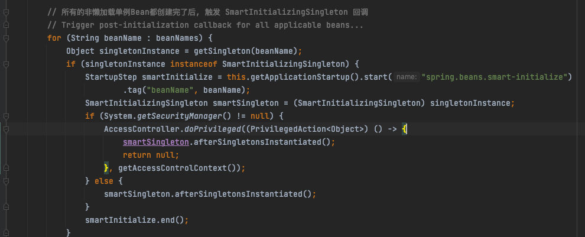
> 可以在这个阶段进行一些通知通告的调用,或者一些缓存的加载了,  因为到了这里基本上是确定所有的Bean都已经初始化完成

## 阶段九、Bean销毁阶段
从源码角度来说, 触发SpringBean进行销毁的场景有以下两种

- 调用 `AbstractAutowireCapableBeanFactory#destroyBean`

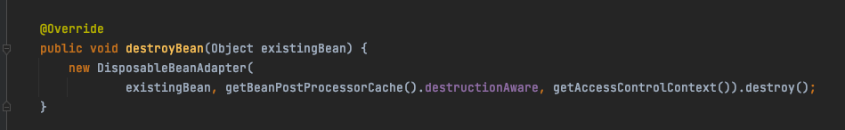

- 调用`ConfigurableBeanFactory#destroySingletons` 前文说过,  这个只有一个最终实现就是, **DefaultListableBeanFactory,  **同时还有一个`AbstractApplicationContext#close`,  但是这个方法最终还会回到`ConfigurableBeanFactory#destroySingletons`

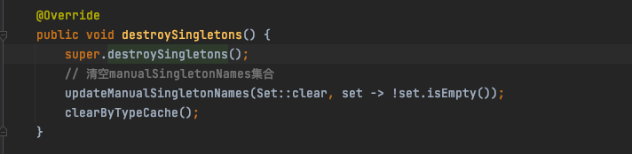
### 1. AbstractAutowireCapableBeanFactory#destroyBean 
基于这个流程的最终调用会到  `DisposableBeanAdapter#destroy`
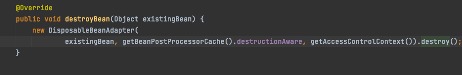
### 2. ConfigurableBeanFactory#destroySingletons
基于`ConfigurableBeanFactory`的`bean`销毁调用路径如下(从context.close() 开始):

1. `AbstractApplicationContext#doClose`
2. `AbstractApplicationContext#destroyBeans`
3. `DefaultListableBeanFactory#destroySingletons`
4. `DefaultSingletonBeanRegistry#destroySingletons`
5. `DefaultSingletonBeanRegistry#destroySingleton`
6. `DefaultSingletonBeanRegistry#destroyBean`
7. `DisposableBean#destroy`
> 跟进发现其实基于 ConfigurableBeanFactory的调用最终会调用到  `DisposableBeanAdapter#destroy`, 但是两种调用路径的区别在于: `AbstractAutowireCapableBeanFactory#destroyBean`直接调用的生成的 `DisposableBeanAdapter#destroy` 没有`destoryMethod`,导致不能调用自定义的销毁方法

### DisposableBeanAdapter#destroy 调用的逻辑说明
#### 第一步、调用DestructionAwareBeanPostProcessor的postProcessBeforeDestruction 
这个阶段主要是执行了关键一个Processor: **InitDestroyAnnotationBeanPostProcessor****,  **这个Processor在销毁阶段会执行 `@PreDestroy` 这个注解的方法 
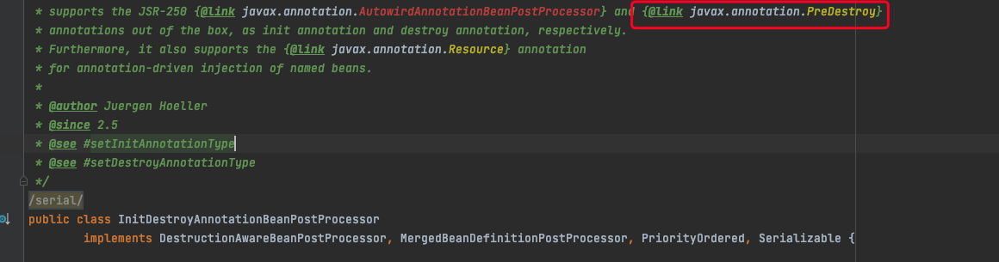
同时,也可以自定义实现` DestructionAwareBeanPostProcessor#postProcessBeforeDestruction` 进行相关销毁拦截

小小测试一下
```java
@Test
public void testDestructionAwareBeanPostProcessor() {
    AnnotationConfigApplicationContext ctx = new AnnotationConfigApplicationContext();
    ctx.refresh();
    ctx.getBeanFactory().addBeanPostProcessor(new DestructionAwareBeanPostProcessor() {
        @Override
        public void postProcessBeforeDestruction(Object bean, String beanName) throws BeansException {
            if (DestructionAwareBeanPostProcessorBean.class.equals(bean.getClass())) {
                System.out.println("执行 DestructionAwareBeanPostProcessorBean 的销毁");
            }
        }
    });
    ctx.register(DestructionAwareBeanPostProcessorBean.class);
    ctx.getBean(DestructionAwareBeanPostProcessorBean.class);
    ctx.close();
}
// 输出
执行 DestructionAwareBeanPostProcessorBean 的销毁
```
 
#### 第二步、 执行DisposableBean的destory
这个阶段的执行源码如下:
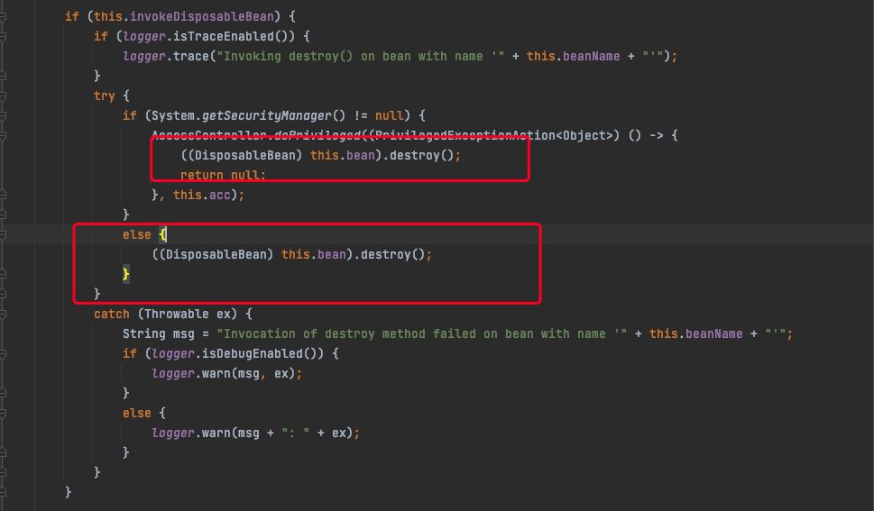
通过一个简单的例子看下
```java
public class BeanDestroyBean implements DisposableBean {
	@Override
	public void destroy() throws Exception {
		System.out.println("DisposableBean 执行");
	}

	@PreDestroy
	public void preDestroy(){
		System.out.println("PreDestroy执行");
	}
}

@Test
public void testDestroyBean() {
    AnnotationConfigApplicationContext ctx = new AnnotationConfigApplicationContext();
    ctx.refresh();
    ctx.register(BeanDestroyBean.class);
    ctx.getBean(BeanDestroyBean.class);
    ctx.close();
}
// 输出
PreDestroy执行
DisposableBean 执行
```
#### 第三步、执行自定义的销毁方法
这个步骤就是执行Bean的自定义的一些销毁方法, 定义销毁方法的方式和定义初始化方法一致, 这里针对基于  `@Bean`  的方式来进行简单示例
```java
public class BeanCustomBeanDestroy {
	public void customDestroy(){
		System.out.println("执行 自定义销毁方法");
	}
}
@Configuration
public class BeanDestroyConfiguration {
	@Bean(destroyMethod = "customDestroy")
	public BeanCustomBeanDestroy beanCustomBeanDestroy(){
		return new BeanCustomBeanDestroy();
	}
}
	@Test
public void testCustomDestroyMethod(){
		AnnotationConfigApplicationContext ctx = new AnnotationConfigApplicationContext(BeanDestroyConfiguration.class);;
		ctx.close();
}
//输出
执行 自定义销毁方法
```


# 第三部分、生命周期钩子
> SpringBean 生命周期第[1]步: 		执行 InstantiationAwareBeanPostProcessor#postProcessBeforeInstantiation 回调
> SpringBean 生命周期第[2]步: 		执行 SmartInstantiationAwareBeanPostProcessor#determineCandidateConstructors回调
> SpringBean 生命周期第[3]步: 		执行 MergedBeanDefinitionPostProcessor#postProcessMergedBeanDefinition 回调
> SpringBean 生命周期第[4]步: 		执行 InstantiationAwareBeanPostProcessor#postProcessAfterInstantiation 回调
> SpringBean 生命周期第[5]步: 		执行 InstantiationAwareBeanPostProcessor#postProcessProperties 回调
> SpringBean 生命周期第[6]步: 		执行 CommonAnnotationBeanPostProcessor#postProcessProperties 回调, 处理JSR-250自动注入
> SpringBean 生命周期第[7]步: 		执行 AutowiredAnnotationBeanPostProcessor#postProcessProperties 回调, 处理Spring自动注入
> SpringBean 生命周期第[8]步: 		执行  BeanNameAware#setBeanName 回调
> SpringBean 生命周期第[9]步: 		执行  BeanClassLoaderAware#setBeanClassLoader 回调
> SpringBean 生命周期第[10]步: 	执行  BeanFactoryAware#beanFactory 回调
> SpringBean 生命周期第[11]步: 	执行  ApplicationContextAware#setApplicationContext 回调
> SpringBean 生命周期第[12]步: 	执行 BeanPostProcessor#postProcessBeforeInitialization 回调
> SpringBean 生命周期第[13]步: 	执行 InitDestroyAnnotationBeanPostProcessor#postProcessBeforeInitialization  @PostConstruct  回调
> SpringBean 生命周期第[14]步: 	执行  InitializingBean#afterPropertiesSet 回调
> SpringBean 生命周期第[15]步: 	执行 自定义初始化方法 回调
> SpringBean 生命周期第[16]步: 	执行 BeanPostProcessor#postProcessAfterInitialization 回调
> SpringBean 生命周期第[17]步: 	执行 DestructionAwareBeanPostProcessor#postProcessBeforeDestruction 回调
> SpringBean 生命周期第[18]步: 	执行  InitDestroyAnnotationBeanPostProcessor.postProcessBeforeDestruction @PreDestroy 回调
> SpringBean 生命周期第[19]步: 	执行  DisposableBean#destroy 回调
> SpringBean 生命周期第[20]步: 	执行 自定义销毁方法 回调


