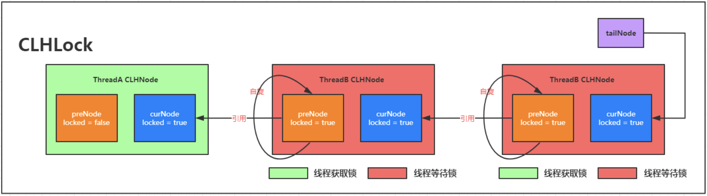

## 一、从手撸一个AQS基础框架开始? 
> 我们都知道AQS底层实现是一个 `CLH`的变种、 加上一部分设计模式、一部分CAS自旋实现的几个无锁队列模版,  来看看一个简单的CLH的实现

### 加锁
加锁是一个竞争行为, 从本质上来讲, 加锁就是对某一个资源数据的修改, 以CLH为例, 多线程竞争加锁其实就是修改 `tailNode`这个悬挂指针的前驱节点,  将其前驱指向自身的持有的节点, 并将自身的前驱指向 `tailNode`原来的前驱, 在当前锁没有被占用的情况下, 可以直接占有锁并开始操作;  如果锁已经被占用则需要等待前驱节点释放锁; 
`CLH` 巧妙的用队列实现, 并发情况下一起进行`CAS`操作进行入队申请, 一旦入队成功, 则进行前驱状态自旋, 这样避免的加锁行为, 其次在等待锁的过程中, 也只会对前驱一个状态进行自旋, 且没有`CAS`操作 (这里可以对照MCS的CAS就知道了)

### 解锁
相对于加锁, 解锁行为则更加的简单, 只需要对自身的加锁状态进行一个变化, 从加锁状态修改为解锁状态

### 代码实现
```java
class CLH{
        private volatile AtomicReference<CLHLockNode> tail = new AtomicReference<>(null);
        private static ThreadLocal<CLHLockNode> CUR_NODE = new ThreadLocal<>();
        public void acquire() {
            // add to queue
            CLHLockNode curNode = new CLHLockNode();
            CUR_NODE.set(curNode);
            CLHLockNode preNode = tail.getAndSet(curNode);
            curNode.prev = preNode;
            while (null != curNode.prev && curNode.prev.locked){
            }
        }
        public void release() {
            if(null == CUR_NODE.get()){
                return;
            }
            CUR_NODE.get().locked = false;
        }

        static class CLHLockNode{
            private volatile boolean locked = true;
            private volatile CLHLockNode prev = null;
        }
    }
```
### 测试代码
> 基本上  一百万数据  2019 4C16G 的mbp 测试下来耗时 在 0.5 - 1 秒

```java
private volatile int counter = 0;
@Test
public void testMyCLhLock() throws InterruptedException {
    CLH mylock = new CLH();
    final int countNum = 1000000;
    ThreadPoolExecutor pool = new ThreadPoolExecutor(16,16,60, TimeUnit.SECONDS, new ArrayBlockingQueue<>(countNum));
    CountDownLatch latch = new CountDownLatch(countNum);
    long cur = System.currentTimeMillis();
    for(int i =0;i< countNum; i++){
        pool.submit(() ->{
            try{
                mylock.acquire();
                counter++;
                mylock.release();
            } finally {
                latch.countDown();
            }
        });
    }
    latch.await();
    System.out.println("完成统计,结果:" + counter + ", 耗时:" + (System.currentTimeMillis() - cur));
}
```
## 二、如何实现可重入? 
问: 思考一下上面的实现, 如果一个线程多次 `acquire` 了, 怎么办?  如何确保多次 `acquire` 后还能够正确的释放锁? 
答: 其实很简单, 加入一个重入标记 `flag`,  每次加锁成功 加一、释放锁则 减一

问: 但是问题来了, 如果按照当前的排队模式, 肯定不行, 那会导致一个线程在队列中两次出现, 后面的 `acquire`会永远阻塞前面锁的 `release` 节点, 也就发生了死锁(是不是瞬间理解为什么要可重入设计)；
答:  解决方案也简单, 增加一次对当前线程的判断即可,  从这里我们开始取消
### 代码实现
```java
    static class CLH{
        private volatile AtomicReference<CLHLockNode> tail = new AtomicReference<>(null);
        private volatile AtomicReference<Thread> THREAD_HOLDER = new AtomicReference<>(null);
        private static volatile ThreadLocal<CLHLockNode> CUR_NODE = new ThreadLocal<>();
        private volatile AtomicInteger entrytime = new AtomicInteger(0);

        public void acquire() {
            final Thread tThread = Thread.currentThread();
            if (Objects.equals(tThread, THREAD_HOLDER.get())) {
                entrytime.incrementAndGet();
                return;
            }
            // add to queue
            CLHLockNode curNode = CUR_NODE.get();
            if (null == curNode) {
                curNode = new CLHLockNode();
                CUR_NODE.set(curNode);
            }
            CLHLockNode preNode = tail.getAndSet(curNode);
            curNode.prev = preNode;

            // spin for unlock
            while (null != curNode.prev && curNode.prev.locked){}

            THREAD_HOLDER.set(tThread);
            entrytime.incrementAndGet();
        }
        public void release() {
            CLHLockNode curNode = CUR_NODE.get();
            if(null == curNode){
                return;
            }
            if(entrytime.decrementAndGet() == 0){
                THREAD_HOLDER.set(null);
                CUR_NODE.set(null); // -- 这一行有BUG,如果没有这一行会有问题, 有兴趣的可以自行研究一下
                curNode.locked = false;
            }
        }
        public static class CLHLockNode{
            private volatile boolean locked = true;
            private volatile CLHLockNode prev = null;
        }
    }
```
### 测试代码
>  百万级数据 基本性能持平 

```java
    private volatile int counter = 0;
    @Test
    public void testMyCLhLock() throws InterruptedException {
        CLH mylock = new CLH();
        final int countNum = 10000000;
        ThreadPoolExecutor pool = new ThreadPoolExecutor(16,16,60, TimeUnit.SECONDS, new ArrayBlockingQueue<>(countNum));
        CountDownLatch latch = new CountDownLatch(countNum);
        long cur = System.currentTimeMillis();
        for(int i =0;i< countNum; i++){
            pool.submit(() ->{
                try{
                    mylock.acquire();
                    mylock.acquire();
                    counter++;
                    mylock.release();
                    mylock.release();
                } finally {
                    latch.countDown();
                }
            });
        }
        latch.await();
        System.out.println("完成统计,结果:" + counter + ", 耗时:" + (System.currentTimeMillis() - cur));
    }
```

## 三、如何实现 公平/非公平
说人话就是，AQS本身没有对公平非公平进行支持, 在Reentenct

- 公平模式:  大家都老老实实从后面开始排队
- 非公平模式: 当大家来排队的时候, 先想办法直接去尝试获取一次锁

AQS 本身只是开放了这么个功能给到, 作为模版, 实现者如果想进行非公平实现, 则对对应的模版拓展点进行实现

需要注意, 如果想要引入非公平特性, 那么在当前持锁节点和最新的待锁节点中间, 存在「被插队」可能性, 上文实现的 「while」模式如果继续加入一个新线程来 「while」就会引发锁被多个线程持有的情况,  那这就不是 「公平/非公平」了, 而是「大同」

那么该如何才能实现「插队」这个功能呢? 必须在
### 代码实现
## 
## 四、如何实现多「Permit」
