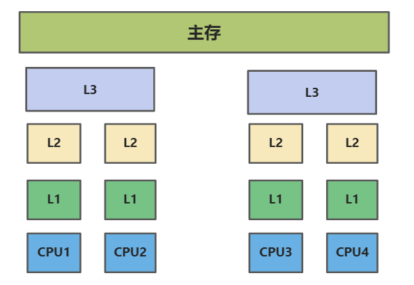
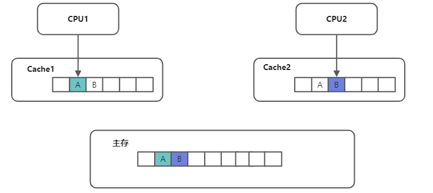
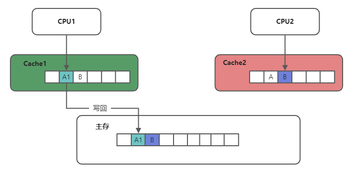
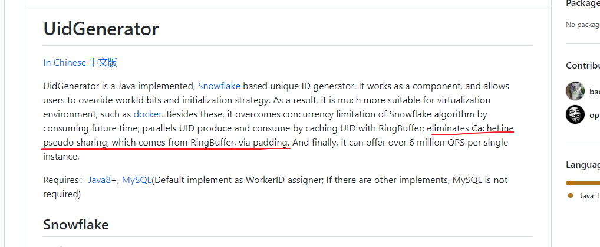

## 一、什么是伪共享?
在我们讨论伪共享之前，我们需要先了解以下知识：

- CPU缓存是怎么样架构的？
- 共享代表着什么？
- 缓存行是什么概念,有哪些约束？
- 缓存一致性协议约束了什么？

### 1.1 先看缓存相关概念

#### 1.1.1  什么是CPU缓存
> 我们都知道 CPU 和主内存之间的运算速度是差异巨大的, 在现今的多核CPU操作系统中，往往会在 CPU 和主存间设置多级高速缓存 ; 
下图是计算机的基本结构, L1、L2、L3分别表示一级缓存、二级缓存、三级缓存, 越靠近CPU的缓存，速度越快，容量也越小:
-  L1缓存很小但很快，并且紧靠着在使用它的CPU内核； 
- L2大一些，也慢一些，并且仍然只能被一个单独的CPU核使用；
- L3更大、更慢，并且被单个插槽上的所有CPU核共享；
- 最后是主存，由全部插槽上的所有CPU核共享


当CPU执行运算的时候，它先去L1查找所需的数据、再去L2、然后是L3，如果最后这些缓存中都没有，所需的数据就要去主内存拿。走得越远，操作指令越多, 运算耗费的时间就越长;  
下面是从CPU访问不同层级数据的时间(大约):

| **从CPU到** | **大约需要的CPU周期** | **大约需要的时间** |
| --- | --- | --- |
| 主存 | - | 约60-80ns |
| L3 cache | 约40-45 cycles | 约15ns |
| L2 cache | 约10 cycles | 约3ns |
| L1 cache | 约3-4 cycles | 约1ns |
| 寄存器 |  1 cycle | - |

#### 1.1.2 缓存行的概念
首先需要明白一个概念,  缓存数据在 L1~L3 各级别中存储格式是 CacheLine的形式;  每一个CPU 缓存都由很多个缓存行组成; 
缓存行通常的大小是 64 字节,  同时, CPU 每次从主存中拉去数据到缓存, 都是以CacheLine为基本单位, 也就是意味着当你去内存中读取一个小于64字节的数据时, **Cache 会把这个数据周围总共 64字节的数据全部拉过来**;

#### 1.1.3 缓存一致性协议MESI
> 缓存一致性协议是为了保障多个CPU绑定的多个CPU缓存之间, 缓存数据一致性问题而产生的一种系统规范

MESI规定了一个cache line存在四种状态：Modified、Exclusive、Shared 和 Invalid，这有点像状态机的转换，理清全部的状态较复杂，我们关注简单的：
1. Modified：该缓存行只被缓存在该CPU的缓存中，并且是被修改过的，即与主存中的数据不一致，该缓存行中的内存需要在未来的某个时间点（允许其它CPU读取请主存中相应内存之前）写回主存。当被写回主存之后，该缓存行的状态会变成Exclusive状态。
2. Exclusive：该缓存行只被缓存在该CPU的缓存中，它是未被修改过的，与主存中数据一致。该状态可以在任何时刻当有其它CPU读取该内存时变成Shared状态。同样地，当CPU修改该缓存行中内容时，该状态可以变成Modified状态。
3. Shared：该状态意味着该缓存行可能被多个CPU缓存，并且各个缓存中的数据与主存数据一致，当有一个CPU修改该缓存行中，其它CPU中该缓存行可以被作废。
4. Invalid：该缓存是无效的（可能有其它CPU修改了该缓存行）。

### 1.2 再来看什么是伪共享问题?

1、CPU 1 和 CPU2 分别持有一个CPU Cache, CPU1 下线程需要对A进行引用，CPU2下线程需要对B进行引用;

但因缓存行问题，主存把A,B装载在一行内, 两个CPU此时会同时将A,B都加载到各自的CPU高速缓存中


2、 CPU1线程对A进行修改, 将A 修改为 A1, 因缓存一致性问题, 此时CPU1的缓存行变为已修改状态, 因为缓存一致性协议要求, CPU2的Cache会变为失效状态(目的是避免数据不一致问题出现), 此时CPU2需要从主存中重新读取数据

**问题来了:**

> 如果此时CPU1 频繁对A进行修改, 那么就会导致CPU2 的缓存中的缓存行频繁失效,B数据未变更但是每次都需要取主存获取数据, 这样CPU2的缓存相当于是无效的




### 1.3 总结一下
#### 1.3.1 一句话描述
伪共享是指多个线程分别对独立的数据进行访问修改时,  因各自独立的数据在同一个CPU 缓存的缓存行, 受缓存一致性协议约束, 缓存频繁失效导致缓存无法被利用,  多个线程频繁从主存中拉取数据, 性能变得低下; 

#### 1.3.2 伪共享会导致什么问题
如果一个数据频繁地修改，就会导致这个数据同一个缓存行的数据CPU缓存无效化，每次读取都需要从主存获取，在一些应用场景下是会严重影响性能的；

#### 1.3.3 场景举例
- 序列生成器，如Snowflake 算法之类的内存生成器，在内存布局周边的数据就有可能会频繁的失效，从而导致性能下降问题， 百度的SnowFlake 官方是说明通过字节填充修复了该问题的

  

## 二、如何解决伪共享?
### 2.1字节填充
因为一个CacheLine 是64 字节，只需要在具体的数据前后各填充足够的无用数据，就能够保障每次读取数据不会将其他无关的数据读取过来

#### 测试案例
```java
public class FakeShareTest {
    //伪共享
    static class FakeShare {
        long l1;
        long l2;
        long l3;
        long l4;
    }
    // 填充字节
    static class RealShare {
        long l01, l02, l03, l04, l05, l06, l07; long l1;
        long l11, l12, l13, l14, l15, l16, l17; long l2;
        long l21, l22, l23, l24, l25, l26, l27; long l3;
        long l31, l32, l33, l34, l35, l36, l37; long l4;
        long l41, l42, l43, l44, l45, l46, l47;
    }

    public static final int M = 100000000;
    public static long fake() throws InterruptedException {
        FakeShare share = new FakeShare();
        long start = System.currentTimeMillis();

        Thread t1 = new Thread(() -> {
            for (int i = 0; i < M; i++) {
                share.l1++;
            }
        });
        Thread t2 = new Thread(() -> {
            for (int i = 0; i < M; i++) {
                share.l2++;
            }
        });
        Thread t3 = new Thread(() -> {
            for (int i = 0; i < M; i++) {
                share.l3++;
            }
        });
        Thread t4 = new Thread(() -> {
            for (int i = 0; i < M; i++) {
                share.l4++;
            }
        });
        t1.start();
        t2.start();
        t3.start();
        t4.start();
        t1.join();
        t2.join();
        t3.join();
        t4.join();
        return System.currentTimeMillis() - start;
    }

    public static long real() throws InterruptedException {
        RealShare share = new RealShare();
        long start = System.currentTimeMillis();
        Thread t1 = new Thread(() -> {
            for (int i = 0; i < M; i++) {
                share.l1++;
            }
        });
        Thread t2 = new Thread(() -> {
            for (int i = 0; i < M; i++) {
                share.l2++;
            }
        });
        Thread t3 = new Thread(() -> {
            for (int i = 0; i < M; i++) {
                share.l3++;
            }
        });
        Thread t4 = new Thread(() -> {
            for (int i = 0; i < M; i++) {
                share.l4++;
            }
        });
        t1.start();
        t2.start();
        t3.start();
        t4.start();
        t1.join();
        t2.join();
        t3.join();
        t4.join();
        return System.currentTimeMillis() - start;
    }

    public static void main(String[] args) throws InterruptedException {
        long fr = fake();
        System.out.println("fake share result:" + fr);
        Thread.sleep(1000);
        long rr = real();
        System.out.println("real  share result:" +rr);
    }
}
```
输入结果如下, 处理过伪共享后性能约提升了 5-10 倍，当然实际场景实际分析
```shell
fake share result:369
real  share result:25
```

#### 引申思考
如果上列中的 非填充数据字段类型 `long` 都变为 `volatile`修饰，会有什么变化？ 以及为什么？


### 2.2 卡表先行检查(难模拟)
JDK7 以后支持配置参数： **-XX：+UseCondCardMark**； 卡表标记屏障？
reference:   深入理解Java虚拟机：JVM高级特性与最佳实践（第3版）   
