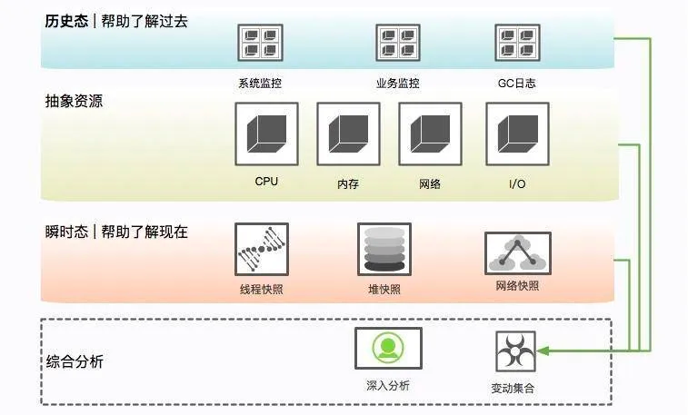

如果一个实例发生了问题，根据情况选择，要不要着急去重启。如果出现的CPU、内存飙高或者日志里出现了OOM异常
**第一步是隔离**，第二步是**保留现场**，第三步才是**问题排查**。
### 隔离
就是把你的这台机器从请求列表里摘除，比如把 nginx 相关的权重设成零
### 现场保留
#### 保留状态分析
查看比如 CPU、系统内存等，通过历史状态可以体现一个趋势性问题，而这些信息的获取一般依靠监控系统的协作

#### 操作系统层面快速存留
| **资源信息** | **命令** | **解释说明** |
| --- | --- | --- |
| **系统当前网络连接** | ss -antp > $DUMP_DIR/ss.dump 2>&1 | 
1. 使用 ss 命令而不是 netstat 的原因，是因为 netstat 在网络连接非常多的情况下，执行非常缓慢
2. 后续的处理，可通过查看各种网络连接状态的梳理，来排查 TIME_WAIT 或者 CLOSE_WAIT，或者其他连接过高的问题，非常有用
 |
| **网络状态统计** | netstat -s > $DUMP_DIR/netstat-s.dump 2>&1 | 它能够按照各个协议进行统计输出，对把握当时整个网络状态，有非常大的作用 |
|  | sar -n DEV 1 2 > $DUMP_DIR/sar-traffic.dump 2>&1 | 在一些速度非常高的模块上，比如 Redis、Kafka，就经常发生跑满网卡的情况。表现形式就是网络通信非常缓慢 |
| **进程资源** | lsof -p $PID > $DUMP_DIR/lsof-$PID.dump | 通过查看进程，能看到打开了哪些文件，可以以进程的维度来查看整个资源的使用情况，包括每条网络连接、每个打开的文件句柄。
同时，也可以很容易的看到连接到了哪些服务器、使用了哪些资源。这个命令在资源非常多的情况下，输出稍慢，请耐心等待 |
| **CPU 资源** | 
- mpstat > $DUMP_DIR/mpstat.dump 2>&1
- vmstat 1 3 > $DUMP_DIR/vmstat.dump 2>&1
- sar -p ALL  > $DUMP_DIR/sar-cpu.dump  2>&1
- uptime > $DUMP_DIR/uptime.dump 2>&1
 | 主要用于输出当前系统的 CPU 和负载，便于事后排查 |
| **I/O 资源** | 
- mpstat > $DUMP_DIR/mpstat.dump 2>&1
- vmstat 1 3 > $DUMP_DIR/vmstat.dump 2>&1
- sar -p ALL  > $DUMP_DIR/sar-cpu.dump  2>&1
- uptime > $DUMP_DIR/uptime.dump 2>&1
 | 一般，以计算为主的服务节点，I/O 资源会比较正常，但有时也会发生问题，比如**日志输出过多，或者磁盘问题**等。
此命令可以输出每块磁盘的基本性能信息，用来排查 I/O 问题。 |
| **内存问题** | free -h > $DUMP_DIR/free.dump 2>&1 | free 命令能够大体展现操作系统的内存概况，这是故障排查中一个非常重要的点，比如 SWAP 影响了 GC，SLAB 区挤占了 JVM 的内存 |
| **其他全局** | ps -ef > $DUMP_DIR/ps.dump 2>&1
dmesg > $DUMP_DIR/dmesg.dump 2>&1
sysctl -a > $DUMP_DIR/sysctl.dump 2>&1 | dmesg 是许多静悄悄死掉的服务留下的最后一点线索。当然，ps 作为执行频率最高的一个命令，由于内核的配置参数，会对系统和 JVM 产生影响 |

#### Java 语言工具快速存留
| **资源信息** | **命令** | **解释说明** |
| --- | --- | --- |
| **进程快照** | jinfo $PID > $DUMP_DIR/jinfo.dump 2>&1 | 此命令将输出 Java 的基本进程信息，包括**环境变量和参数配置**，可以查看是否因为一些错误的配置造成了 JVM 问题 |
| **dump 堆信息** | jstat -gcutil $PID > $DUMP_DIR/jstat-gcutil.dump 2>&1 | 
 |
|  | jstat -gccapacity $PID > $DUMP_DIR/jstat-gccapacity.dump 2>&1 |  |
|  | jmap $PID > $DUMP_DIR/jmap.dump 2>&1 | jmap 将会得到当前 Java 进程的 dump 信息。
如上所示，其实最有用的就是第 4 个命令，但是前面三个能够让你初步对系统概况进行大体判断。因为，第 4 个命令产生的文件，一般都非常的大。而且，需要下载下来，导入 MAT 这样的工具进行深入分析，才能获取结果。这是分析内存泄漏一个必经的过程。 |
|  | jmap -heap $PID > $DUMP_DIR/jmap-heap.dump 2>&1 |  |
|  | jmap -histo $PID > $DUMP_DIR/jmap-histo.dump 2>&1 |  |
|  | jmap -dump:format=b,file=$DUMP_DIR/heap.bin $PID > /dev/null  2>&1 |  |
| **JVM 执行栈** | jstack $PID > $DUMP_DIR/jstack.dump 2>&1 | jstack 将会获取当时的执行栈。一般会多次取值，我们这里取一次即可。这些信息非常有用，能够还原 Java 进程中的线程情况。 |
|  | top -Hp $PID -b -n 1 -c >  $DUMP_DIR/top-$PID.dump 2>&1 | 为了能够得到更加精细的信息，我们使用 top 命令，来获取进程中所有线程的 CPU 信息，这样，就可以看到资源到底耗费在什么地方了 |

